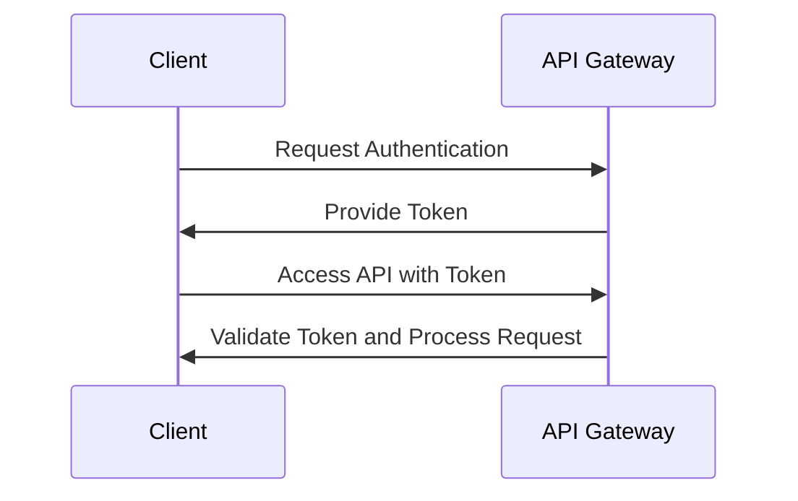
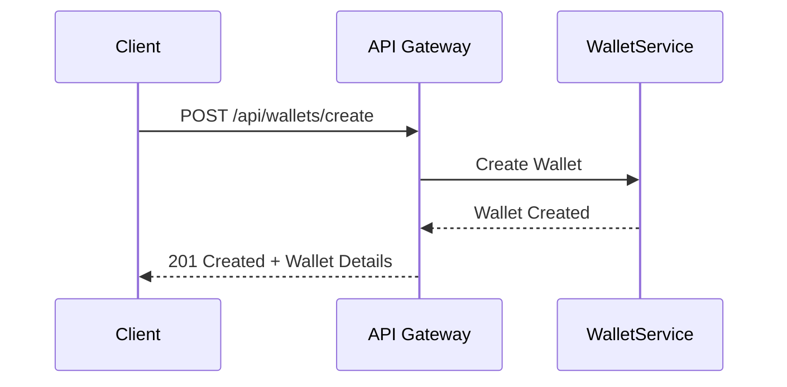
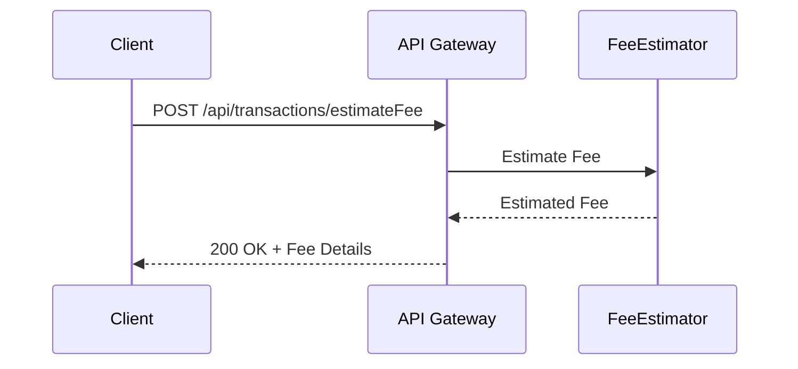
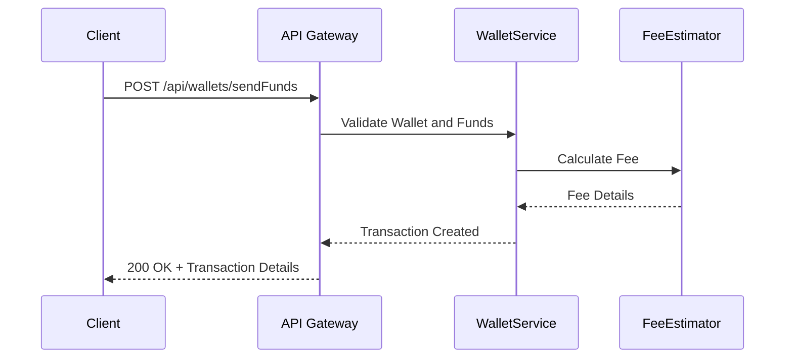

# API Reference Document

## 1. API Overview

### API Purpose and Capabilities
This API is designed to facilitate operations related to Bitcoin transactions and wallet management within a cryptocurrency and blockchain technology domain. It provides functionalities for creating and managing wallets, estimating transaction fees, handling transaction inputs and outputs, and managing cryptographic keys.

### Base URL and Versioning
- Base URL: [Requires additional context]
- Versioning: [Requires additional context]

### Authentication Requirements
The API requires authentication to ensure secure access to wallet and transaction operations. Authentication is typically handled via token-based methods.

### Rate Limiting and Quotas
- Rate Limiting: [Requires additional context]
- Quotas: [Requires additional context]

## 2. Authentication

### Authentication Methods
- Token-based authentication is used to secure API endpoints.

### Token Formats
- Tokens are typically JSON Web Tokens (JWT) or similar formats. [Requires additional context]

### Authentication Flow


### Error Responses
- 401 Unauthorized: Invalid or missing token.
- 403 Forbidden: Token does not have access rights.

## 3. Common Patterns

### Request Format
- JSON format is used for requests.

### Response Format
- JSON format is used for responses.

### Pagination
- Pagination is supported using query parameters such as `page` and `limit`. [Requires additional context]

### Filtering and Sorting
- Filtering and sorting can be applied using query parameters. [Requires additional context]

### Error Handling
- Errors are returned in JSON format with an error code and message.

## 4. Endpoints Reference

### Create Wallet

#### Endpoint/Method Signature
- POST /api/wallets/create

#### Description
Creates a new Bitcoin wallet with a unique ID, label, address, and initializes it with zero balance.

#### Parameters
- `label` (string, required): The label for the wallet.

#### Request Body Schema
```json
{
  "label": "string"
}
```

#### Response Schema
```json
{
  "walletId": "string",
  "address": "string",
  "balance": 0
}
```

#### Status Codes
- 201 Created: Wallet successfully created.
- 400 Bad Request: Invalid parameters.

#### Example Request
```json
POST /api/wallets/create
{
  "label": "My Wallet"
}
```

#### Example Response
```json
{
  "walletId": "abc123",
  "address": "1BitcoinAddress",
  "balance": 0
}
```

#### Error Scenarios
- Missing label parameter results in a 400 error.

#### Sequence Diagram


### Estimate Transaction Fee

#### Endpoint/Method Signature
- POST /api/transactions/estimateFee

#### Description
Estimates the transaction fee based on the amount of satoshis and the satoshis per vbyte rate.

#### Parameters
- `amount` (integer, required): Amount in satoshis.
- `rate` (integer, required): Satoshis per vbyte rate.

#### Request Body Schema
```json
{
  "amount": 10000,
  "rate": 5
}
```

#### Response Schema
```json
{
  "estimatedFee": "integer"
}
```

#### Status Codes
- 200 OK: Fee estimated successfully.
- 400 Bad Request: Invalid parameters.

#### Example Request
```json
POST /api/transactions/estimateFee
{
  "amount": 10000,
  "rate": 5
}
```

#### Example Response
```json
{
  "estimatedFee": 500
}
```

#### Error Scenarios
- Missing or invalid parameters result in a 400 error.

#### Sequence Diagram


### Send Funds

#### Endpoint/Method Signature
- POST /api/wallets/sendFunds

#### Description
Sends funds from a wallet to a specified address, creating a transaction with calculated fees.

#### Parameters
- `walletId` (string, required): The ID of the wallet.
- `destinationAddress` (string, required): The address to send funds to.
- `amount` (integer, required): The amount in satoshis to send.

#### Request Body Schema
```json
{
  "walletId": "abc123",
  "destinationAddress": "1BitcoinAddress",
  "amount": 5000
}
```

#### Response Schema
```json
{
  "transactionId": "string",
  "fee": "integer"
}
```

#### Status Codes
- 200 OK: Funds sent successfully.
- 400 Bad Request: Invalid parameters.
- 404 Not Found: Wallet not found.

#### Example Request
```json
POST /api/wallets/sendFunds
{
  "walletId": "abc123",
  "destinationAddress": "1BitcoinAddress",
  "amount": 5000
}
```

#### Example Response
```json
{
  "transactionId": "tx123",
  "fee": 500
}
```

#### Error Scenarios
- Insufficient funds result in a 400 error.
- Wallet not found results in a 404 error.

#### Sequence Diagram


## 5. Data Types

### Common Data Types
- **string**: Textual data.
- **integer**: Numeric data without decimals.

### Enumerations
- [Requires additional context]

### Object Schemas
- **TransactionInput**: Represents a Bitcoin transaction input.
- **TransactionOutput**: Represents a Bitcoin transaction output.
- **Utxo**: Represents an Unspent Transaction Output.

## 6. Error Reference

### Error Code Table
| Error Code | Description                  |
|------------|------------------------------|
| 400        | Bad Request                  |
| 401        | Unauthorized                 |
| 403        | Forbidden                    |
| 404        | Not Found                    |

### Error Response Format
```json
{
  "errorCode": "integer",
  "message": "string"
}
```

### Troubleshooting Guide
- Ensure all required parameters are provided.
- Verify token validity and permissions.
- Check wallet existence and balance before sending funds.

## 7. SDKs and Examples

### Available SDKs
- [Requires additional context]

### Quick Start Examples
- [Requires additional context]

### Common Use Cases
- Creating a wallet.
- Estimating transaction fees.
- Sending funds securely.

This document provides a comprehensive overview of the API capabilities, authentication methods, common patterns, endpoint references, data types, error handling, and SDKs. For further details, please refer to the specific sections or contact the development team for additional context where required.