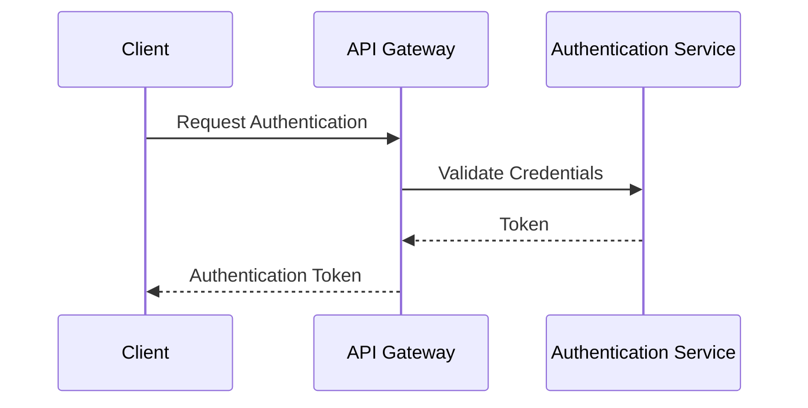
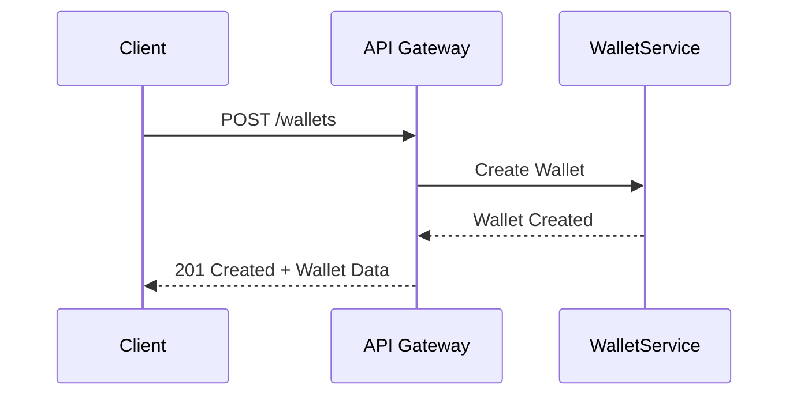
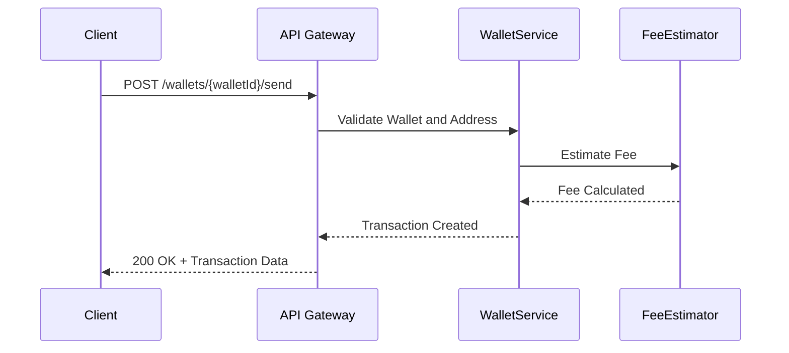
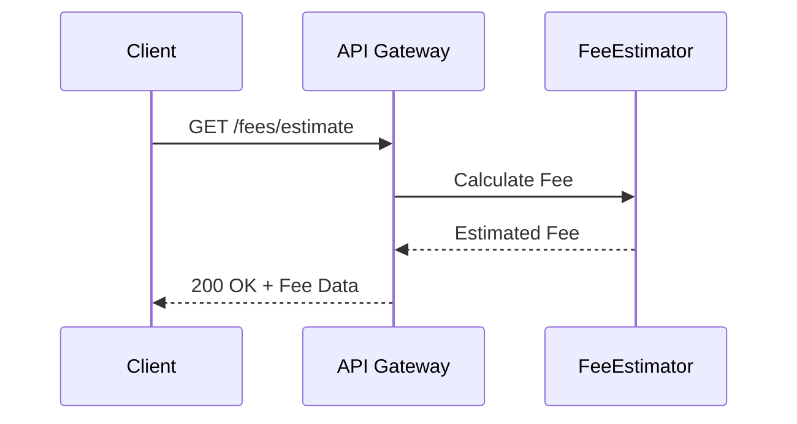

# API Reference Document

## 1. API Overview

### API Purpose and Capabilities
This API is designed to facilitate Bitcoin transaction and wallet management. It provides functionalities for creating and managing wallets, estimating transaction fees, handling Bitcoin transaction inputs and outputs, and managing cryptographic keys.

### Base URL and Versioning
- Base URL: [Requires additional context]
- Version: [Requires additional context]

### Authentication Requirements
- Authentication is required for all endpoints to ensure secure access to wallet and transaction data.

### Rate Limiting and Quotas
- Rate limiting: [Requires additional context]
- Quotas: [Requires additional context]

## 2. Authentication

### Authentication Methods
- [Requires additional context]

### Token Formats
- [Requires additional context]

### Authentication Flow


### Error Responses
- [Requires additional context]

## 3. Common Patterns

### Request Format
- JSON format for requests.

### Response Format
- JSON format for responses.

### Pagination
- [Requires additional context]

### Filtering and Sorting
- [Requires additional context]

### Error Handling
- Standardized error responses with error codes and messages.

## 4. Endpoints Reference

### Create Wallet

#### Endpoint/Method Signature
- POST /wallets

#### Description
Creates a new Bitcoin wallet with a unique ID, label, and address.

#### Parameters
- `label`: string, required, description: The label for the wallet.

#### Request Body Schema
```json
{
  "label": "string"
}
```

#### Response Schema
```json
{
  "walletId": "string",
  "address": "string",
  "balance": 0
}
```

#### Status Codes
- 201 Created
- 400 Bad Request

#### Example Request
```json
POST /wallets
{
  "label": "My Bitcoin Wallet"
}
```

#### Example Response
```json
{
  "walletId": "abc123",
  "address": "1A1zP1eP5QGefi2DMPTfTL5SLmv7DivfNa",
  "balance": 0
}
```

#### Error Scenarios
- Invalid label format: 400 Bad Request

#### Sequence Diagram


### Send Funds

#### Endpoint/Method Signature
- POST /wallets/{walletId}/send

#### Description
Sends funds from a wallet to a specified Bitcoin address.

#### Parameters
- `walletId`: string, required, description: The ID of the wallet.
- `address`: string, required, description: The Bitcoin address to send funds to.
- `amount`: integer, required, description: The amount in satoshis to send.

#### Request Body Schema
```json
{
  "address": "string",
  "amount": "integer"
}
```

#### Response Schema
```json
{
  "transactionId": "string",
  "fee": "integer"
}
```

#### Status Codes
- 200 OK
- 400 Bad Request
- 404 Not Found

#### Example Request
```json
POST /wallets/abc123/send
{
  "address": "1A1zP1eP5QGefi2DMPTfTL5SLmv7DivfNa",
  "amount": 10000
}
```

#### Example Response
```json
{
  "transactionId": "tx123",
  "fee": 500
}
```

#### Error Scenarios
- Insufficient funds: 400 Bad Request
- Wallet not found: 404 Not Found

#### Sequence Diagram


### Estimate Fee

#### Endpoint/Method Signature
- GET /fees/estimate

#### Description
Estimates the transaction fee based on the current satoshis per vbyte rate.

#### Parameters
- `amount`: integer, required, description: The amount in satoshis to be sent.

#### Request Body Schema
- None

#### Response Schema
```json
{
  "estimatedFee": "integer"
}
```

#### Status Codes
- 200 OK
- 400 Bad Request

#### Example Request
```json
GET /fees/estimate?amount=10000
```

#### Example Response
```json
{
  "estimatedFee": 500
}
```

#### Error Scenarios
- Invalid amount: 400 Bad Request

#### Sequence Diagram


## 5. Data Types

### Common Data Types
- `string`: Textual data.
- `integer`: Numeric data.

### Enumerations
- [Requires additional context]

### Object Schemas
- Wallet: Contains walletId, address, balance.
- Transaction: Contains transactionId, fee.

## 6. Error Reference

### Error Code Table
- 400: Bad Request
- 404: Not Found

### Error Response Format
```json
{
  "errorCode": "integer",
  "message": "string"
}
```

### Troubleshooting Guide
- Ensure all required parameters are provided.
- Verify wallet ID and address are correct.

## 7. SDKs and Examples

### Available SDKs
- [Requires additional context]

### Quick Start Examples
- [Requires additional context]

### Common Use Cases
- Creating a wallet.
- Sending Bitcoin funds.
- Estimating transaction fees.

This API Reference Document provides a comprehensive overview of the Bitcoin transaction and wallet management API, detailing its endpoints, authentication, common patterns, and error handling mechanisms. For further information, additional context is required for unsupported sections.