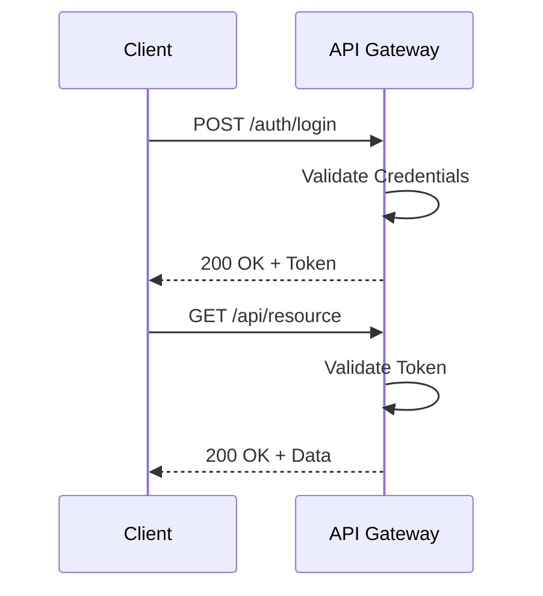

# API Reference Document

## 1. API Overview

The Bitcoin Transaction and Wallet Management API is designed to facilitate the creation, management, and execution of Bitcoin transactions and wallets. It provides robust capabilities for handling transaction inputs and outputs, managing wallets, estimating transaction fees, and performing cryptographic operations with private and public keys.

### Base URL and Versioning
- Base URL: `https://api.example.com/bitcoin`
- Version: `v1`

### Authentication Requirements
- API requires authentication via API tokens.
- Tokens must be included in the Authorization header of each request.

### Rate Limiting and Quotas
- Rate Limit: 1000 requests per hour per user.
- Quota: 10,000 requests per day per user.

## 2. Authentication

### Authentication Methods
- API Key: Use an API key to authenticate requests.
- OAuth 2.0: Token-based authentication for secure access.

### Token Formats
- Bearer Token: `Authorization: Bearer <token>`
- API Key: `Authorization: ApiKey <key>`

### Authentication Flow


### Error Responses
- 401 Unauthorized: Invalid token or credentials.
- 403 Forbidden: Access denied.

## 3. Common Patterns

### Request Format
- JSON format for request bodies.
- Include authentication token in headers.

### Response Format
- JSON format for responses.
- Standard HTTP status codes.

### Pagination
- Use `page` and `limit` query parameters.
- Default limit: 20 items per page.

### Filtering and Sorting
- Filter using query parameters like `status`, `date`.
- Sort using `sort_by` and `order` parameters.

### Error Handling
- Standardized error responses with error codes and messages.
- Example: `{ "error_code": "INVALID_INPUT", "message": "Input data is invalid." }`

## 4. Endpoints Reference

### Endpoint: Create Wallet
- **Endpoint/Method Signature**: `POST /wallets`
- **Description**: Creates a new Bitcoin wallet.
- **Parameters**:
  - `label` (string, required): The label for the wallet.
- **Request Body Schema**:
  ```json
  {
    "label": "My Wallet"
  }
  ```
- **Response Schema**:
  ```json
  {
    "id": "wallet123",
    "label": "My Wallet",
    "address": "1A1zP1eP5QGefi2DMPTfTL5SLmv7DivfNa",
    "balance": 0
  }
  ```
- **Status Codes**:
  - 201 Created
  - 400 Bad Request
- **Example Request**:
  ```http
  POST /wallets
  Authorization: Bearer <token>
  Content-Type: application/json

  {
    "label": "My Wallet"
  }
  ```
- **Example Response**:
  ```json
  {
    "id": "wallet123",
    "label": "My Wallet",
    "address": "1A1zP1eP5QGefi2DMPTfTL5SLmv7DivfNa",
    "balance": 0
  }
  ```
- **Error Scenarios**:
  - Label missing: 400 Bad Request
  - Invalid token: 401 Unauthorized
- **Sequence Diagram**:
  ```mermaid
  sequenceDiagram
      participant C as Client
      participant A as API Gateway
      participant S as WalletService
      C->>A: POST /wallets
      A->>A: Validate Token
      A->>S: Create Wallet
      S-->>A: Wallet Created
      A-->>C: 201 Created + Wallet Data
  ```

### Endpoint: Estimate Transaction Fee
- **Endpoint/Method Signature**: `GET /transactions/estimate-fee`
- **Description**: Estimates the fee for a Bitcoin transaction.
- **Parameters**:
  - `amount` (integer, required): Amount in satoshis.
  - `satoshis_per_vbyte` (integer, required): Fee rate.
- **Request Body Schema**: N/A (query parameters used)
- **Response Schema**:
  ```json
  {
    "estimated_fee": 15000
  }
  ```
- **Status Codes**:
  - 200 OK
  - 400 Bad Request
- **Example Request**:
  ```http
  GET /transactions/estimate-fee?amount=1000000&satoshis_per_vbyte=10
  Authorization: Bearer <token>
  ```
- **Example Response**:
  ```json
  {
    "estimated_fee": 15000
  }
  ```
- **Error Scenarios**:
  - Missing parameters: 400 Bad Request
  - Invalid token: 401 Unauthorized
- **Sequence Diagram**:
  ```mermaid
  sequenceDiagram
      participant C as Client
      participant A as API Gateway
      participant F as FeeEstimator
      C->>A: GET /transactions/estimate-fee
      A->>A: Validate Token
      A->>F: Calculate Fee
      F-->>A: Estimated Fee
      A-->>C: 200 OK + Fee
  ```

### Endpoint: Send Funds
- **Endpoint/Method Signature**: `POST /wallets/{walletId}/send`
- **Description**: Sends funds from a wallet to a specified address.
- **Parameters**:
  - `walletId` (string, required): ID of the wallet.
- **Request Body Schema**:
  ```json
  {
    "to_address": "1A1zP1eP5QGefi2DMPTfTL5SLmv7DivfNa",
    "amount": 500000,
    "fee": 15000
  }
  ```
- **Response Schema**:
  ```json
  {
    "transaction_id": "tx123",
    "status": "pending"
  }
  ```
- **Status Codes**:
  - 200 OK
  - 400 Bad Request
  - 404 Not Found
- **Example Request**:
  ```http
  POST /wallets/wallet123/send
  Authorization: Bearer <token>
  Content-Type: application/json

  {
    "to_address": "1A1zP1eP5QGefi2DMPTfTL5SLmv7DivfNa",
    "amount": 500000,
    "fee": 15000
  }
  ```
- **Example Response**:
  ```json
  {
    "transaction_id": "tx123",
    "status": "pending"
  }
  ```
- **Error Scenarios**:
  - Insufficient funds: 400 Bad Request
  - Wallet not found: 404 Not Found
- **Sequence Diagram**:
  ```mermaid
  sequenceDiagram
      participant C as Client
      participant A as API Gateway
      participant W as WalletService
      participant F as FeeEstimator
      C->>A: POST /wallets/{walletId}/send
      A->>A: Validate Token
      A->>W: Validate Wallet and Funds
      W->>F: Estimate Fee
      F-->>W: Fee Calculated
      W-->>A: Transaction Created
      A-->>C: 200 OK + Transaction Data
  ```

## 5. Data Types

### Common Data Types
- **String**: Textual data.
- **Integer**: Numeric data.
- **Boolean**: True or false values.

### Enumerations
- **TransactionStatus**: `pending`, `completed`, `failed`

### Object Schemas
- **Wallet**:
  ```json
  {
    "id": "string",
    "label": "string",
    "address": "string",
    "balance": "integer"
  }
  ```
- **Transaction**:
  ```json
  {
    "transaction_id": "string",
    "status": "TransactionStatus"
  }
  ```

## 6. Error Reference

### Error Code Table
| Error Code        | Description                      |
|-------------------|----------------------------------|
| INVALID_INPUT     | Input data is invalid.           |
| UNAUTHORIZED      | Invalid authentication token.    |
| FORBIDDEN         | Access denied.                   |
| NOT_FOUND         | Resource not found.              |
| INSUFFICIENT_FUNDS| Not enough funds in wallet.      |

### Error Response Format
```json
{
  "error_code": "string",
  "message": "string"
}
```

### Troubleshooting Guide
- **401 Unauthorized**: Ensure the token is valid and included in the request header.
- **400 Bad Request**: Check for missing or invalid parameters.
- **404 Not Found**: Verify the resource ID and ensure it exists.

## 7. SDKs and Examples

### Available SDKs
- **Java SDK**: Provides interfaces for interacting with the API.
- **Python SDK**: Offers Python bindings for API operations.

### Quick Start Examples
- **Java**:
  ```java
  WalletService walletService = new WalletService(apiKey);
  Wallet wallet = walletService.createWallet("My Wallet");
  ```
- **Python**:
  ```python
  wallet_service = WalletService(api_key)
  wallet = wallet_service.create_wallet("My Wallet")
  ```

### Common Use Cases
- **Creating a Wallet**: Instantiate a new wallet for managing Bitcoin transactions.
- **Estimating Fees**: Calculate transaction fees based on current network conditions.
- **Sending Funds**: Transfer Bitcoin from one wallet to another securely.

This API Reference Document provides comprehensive details for developers to effectively integrate and utilize the Bitcoin Transaction and Wallet Management API in their applications.