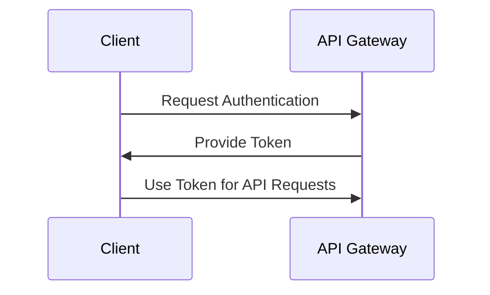
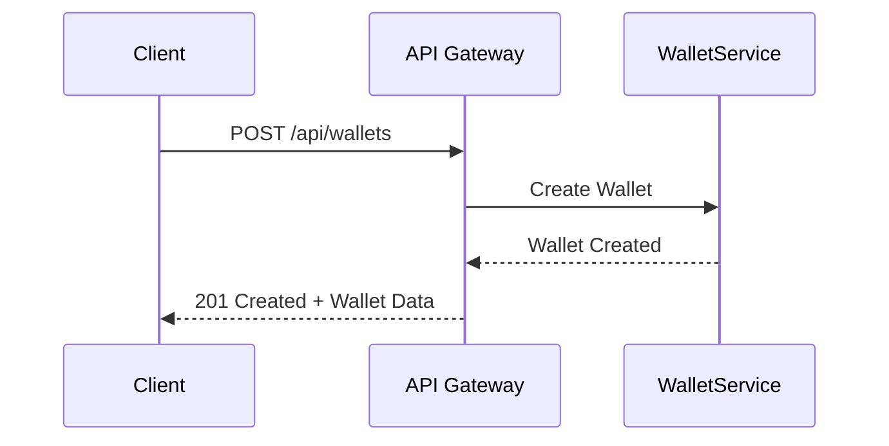
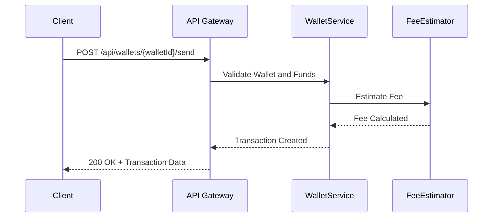
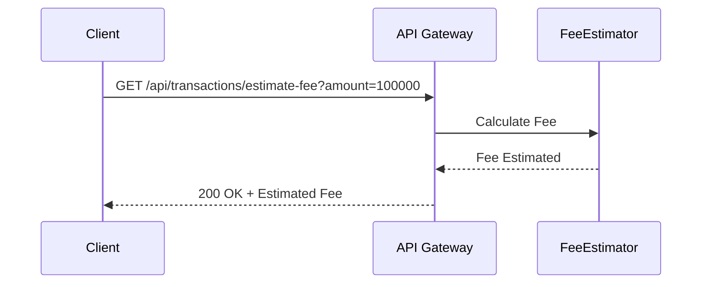

# API Reference Document

## 1. API Overview

### API Purpose and Capabilities
This API is designed to facilitate Bitcoin transaction and wallet management. It provides endpoints for creating wallets, managing transaction inputs and outputs, estimating transaction fees, and handling cryptographic keys. The API supports operations such as sending and receiving funds, refreshing wallet balances, and generating secure cryptographic keys.

### Base URL and Versioning
- Base URL: [Requires additional context]
- Versioning: [Requires additional context]

### Authentication Requirements
- Authentication is required for all endpoints to ensure secure access to wallet and transaction management functionalities.

### Rate Limiting and Quotas
- Rate limiting: [Requires additional context]
- Quotas: [Requires additional context]

## 2. Authentication

### Authentication Methods
- Token-based authentication using secure tokens.

### Token Formats
- Tokens are expected to be in JWT format.

### Authentication Flow


### Error Responses
- 401 Unauthorized: Invalid or missing token.
- 403 Forbidden: Access denied due to insufficient permissions.

## 3. Common Patterns

### Request Format
- JSON format for all requests.

### Response Format
- JSON format for all responses.

### Pagination
- Pagination is supported via `page` and `limit` query parameters.

### Filtering and Sorting
- Filtering and sorting can be applied using query parameters such as `sortBy` and `filter`.

### Error Handling
- Standard error responses include a status code and a message detailing the error.

## 4. Endpoints Reference

### Endpoint: Create Wallet

#### Endpoint/Method Signature
- POST /api/wallets

#### Description
Creates a new Bitcoin wallet with a unique ID, label, address, and initializes it with zero balance.

#### Parameters
- None

#### Request Body Schema
```json
{
  "label": "string"
}
```

#### Response Schema
```json
{
  "walletId": "string",
  "address": "string",
  "balance": 0,
  "publicKey": "string"
}
```

#### Status Codes
- 201 Created: Wallet successfully created.
- 400 Bad Request: Invalid request data.

#### Example Request
```json
POST /api/wallets
{
  "label": "My Bitcoin Wallet"
}
```

#### Example Response
```json
{
  "walletId": "12345",
  "address": "1A1zP1eP5QGefi2DMPTfTL5SLmv7DivfNa",
  "balance": 0,
  "publicKey": "03a34b..."
}
```

#### Error Scenarios
- 400 Bad Request: Missing or invalid label.

#### Sequence Diagram


### Endpoint: Send Funds

#### Endpoint/Method Signature
- POST /api/wallets/{walletId}/send

#### Description
Sends funds from a wallet to a specified address, creating a transaction with calculated fees.

#### Parameters
- `walletId`: string, required, ID of the wallet to send funds from.

#### Request Body Schema
```json
{
  "toAddress": "string",
  "amount": "integer"
}
```

#### Response Schema
```json
{
  "transactionId": "string",
  "fee": "integer",
  "status": "string"
}
```

#### Status Codes
- 200 OK: Funds sent successfully.
- 400 Bad Request: Invalid request data.
- 404 Not Found: Wallet not found.

#### Example Request
```json
POST /api/wallets/12345/send
{
  "toAddress": "1A1zP1eP5QGefi2DMPTfTL5SLmv7DivfNa",
  "amount": 100000
}
```

#### Example Response
```json
{
  "transactionId": "67890",
  "fee": 500,
  "status": "completed"
}
```

#### Error Scenarios
- 400 Bad Request: Insufficient funds.
- 404 Not Found: Wallet ID does not exist.

#### Sequence Diagram


### Endpoint: Estimate Fee

#### Endpoint/Method Signature
- GET /api/transactions/estimate-fee

#### Description
Calculates the estimated fee for a transaction based on the amount of satoshis and the satoshis per vbyte rate.

#### Parameters
- `amount`: integer, required, Amount in satoshis to be sent.

#### Request Body Schema
- None

#### Response Schema
```json
{
  "estimatedFee": "integer"
}
```

#### Status Codes
- 200 OK: Fee estimated successfully.
- 400 Bad Request: Invalid amount.

#### Example Request
```json
GET /api/transactions/estimate-fee?amount=100000
```

#### Example Response
```json
{
  "estimatedFee": 500
}
```

#### Error Scenarios
- 400 Bad Request: Missing or invalid amount.

#### Sequence Diagram


## 5. Data Types

### Common Data Types
- **string**: Textual data.
- **integer**: Numeric data without decimals.

### Enumerations
- **TransactionStatus**: `pending`, `completed`, `failed`.

### Object Schemas
- **Wallet**: Represents a Bitcoin wallet with attributes like ID, address, balance, and public key.
- **Transaction**: Represents a Bitcoin transaction with attributes like transaction ID, fee, and status.

## 6. Error Reference

### Error Code Table
| Code | Description                  |
|------|------------------------------|
| 400  | Bad Request                  |
| 401  | Unauthorized                 |
| 403  | Forbidden                    |
| 404  | Not Found                    |
| 500  | Internal Server Error        |

### Error Response Format
```json
{
  "error": {
    "code": "integer",
    "message": "string"
  }
}
```

### Troubleshooting Guide
- **401 Unauthorized**: Ensure the token is valid and included in the request header.
- **404 Not Found**: Verify the resource ID or endpoint URL.

## 7. SDKs and Examples

### Available SDKs
- [Requires additional context]

### Quick Start Examples
- [Requires additional context]

### Common Use Cases
- Creating a new wallet.
- Sending funds with fee estimation.
- Refreshing wallet balance.

---

This document provides a comprehensive overview of the Bitcoin transaction and wallet management API, detailing its endpoints, authentication methods, and error handling procedures. For further information, please refer to the specific sections above.