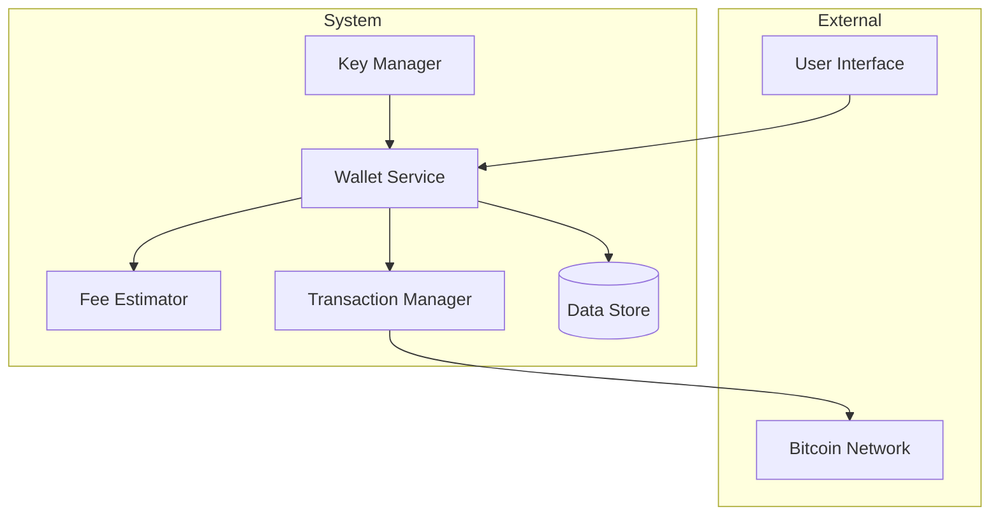
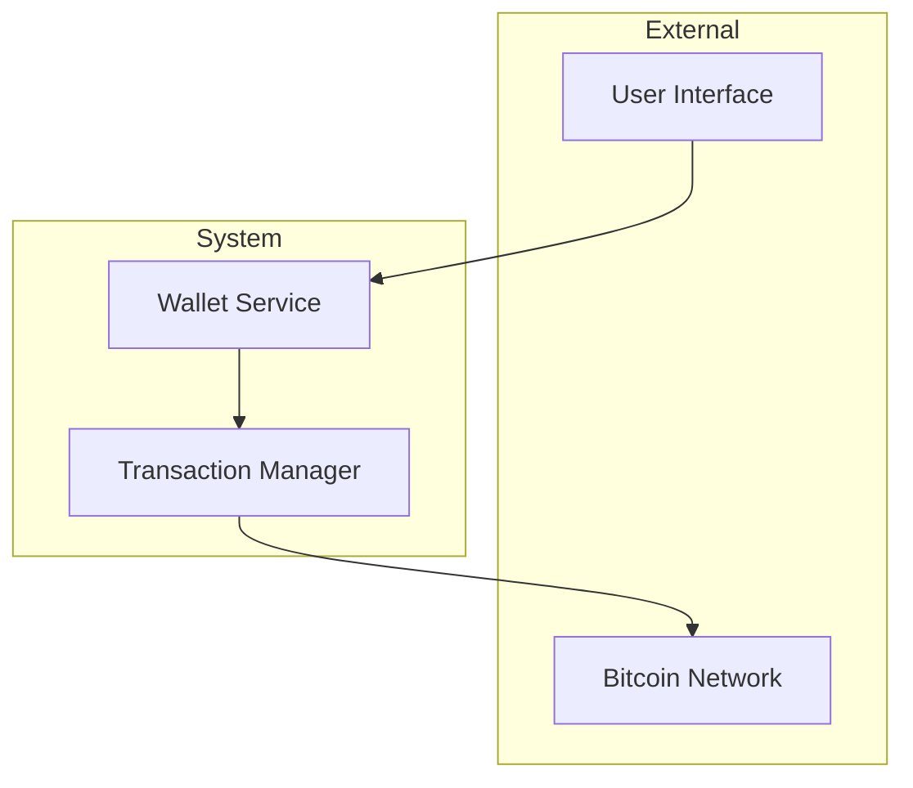
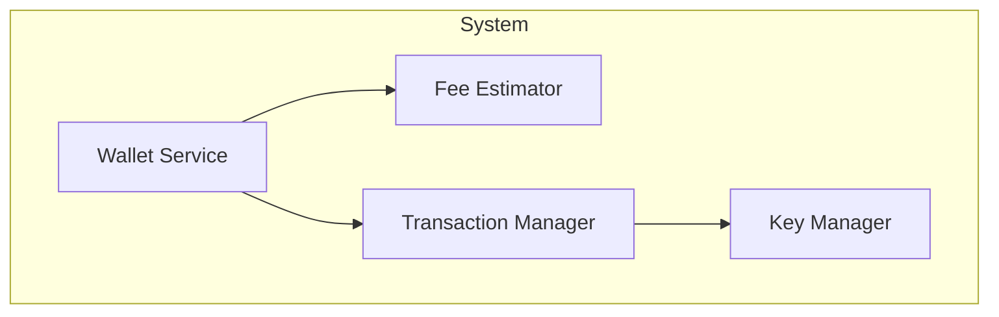
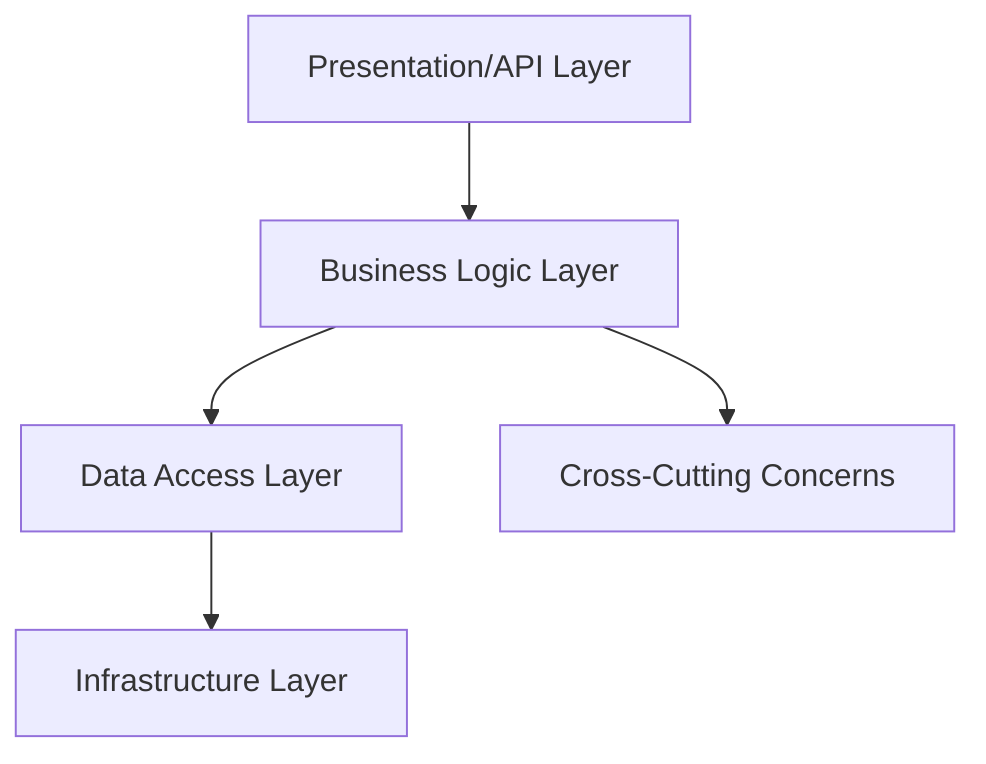
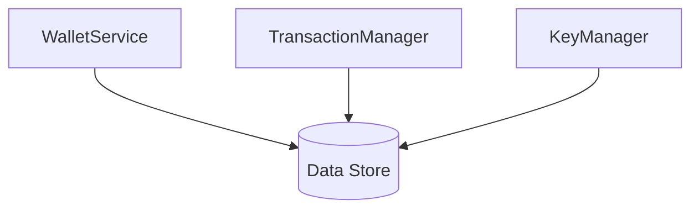
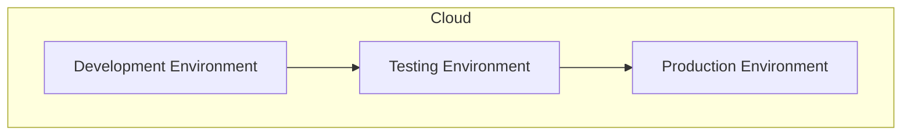
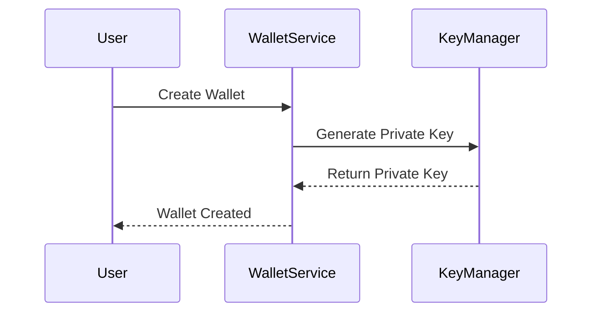

# Architecture Document for Bitcoin Transaction and Wallet Management Framework

## 1. Architecture Overview

### Architectural Style
The architecture of this Bitcoin transaction and wallet management framework is primarily based on a **modular monolith** style. This style allows for clear separation of concerns within the codebase while maintaining a cohesive structure that facilitates efficient communication and integration between components.

### Key Architectural Decisions and Rationale
- **Modular Monolith**: Chosen to balance between the complexity of microservices and the simplicity of a monolith. This allows for easier management of components related to Bitcoin transactions and wallet operations.
- **Kotlin Language**: Selected for its concise syntax and strong support for functional programming, which is beneficial for handling complex data structures like Bitcoin transactions.
- **SecureRandom for Key Generation**: Ensures cryptographic security in generating private keys, which is critical for maintaining the integrity of Bitcoin transactions.

### High-Level Architecture Diagram

## 2. System Context

### System Boundaries
The system is bounded by its interaction with external actors such as users and the Bitcoin network. Internally, it manages components related to wallet services, transaction processing, and key management.

### External Actors and Systems
- **Users**: Interact with the system through a user interface to manage wallets and transactions.
- **Bitcoin Network**: Provides the necessary blockchain infrastructure for transaction validation and execution.

### Communication Protocols
- **HTTP/HTTPS**: Used for user interface interactions.
- **JSON-RPC**: Utilized for communication with the Bitcoin network for transaction processing.

### System Context Diagram

## 3. Component Architecture

### Bitcoin Transaction Input Representation Module
- **Component Name and Classification**: `com.example.bitcoin.TransactionInput` (Module)
- **Responsibilities**: Encapsulates the details of transaction inputs, including source transaction ID, source index, and script signature.
- **Technology Choices and Rationale**: Kotlin data class for efficient data encapsulation and manipulation.
- **Deployment Characteristics**: Part of the core transaction processing framework.
- **Scaling Strategy**: Vertical scaling within the monolith to handle increased transaction input processing.

### Bitcoin Wallet and Fee Management System
- **Component Name and Classification**: `WalletService` (Service Class), `FeeEstimator` (Module)
- **Responsibilities**: Manages wallet lifecycle and estimates transaction fees.
- **Technology Choices and Rationale**: Kotlin for concise syntax and ease of integration with other components.
- **Deployment Characteristics**: Centralized service within the monolith.
- **Scaling Strategy**: Horizontal scaling through replication of service instances.

### Bitcoin Key Management: Private and Public Key Operations
- **Component Name and Classification**: `PrivateKey`, `PublicKey` (Classes)
- **Responsibilities**: Secure generation and conversion of cryptographic keys.
- **Technology Choices and Rationale**: SecureRandom for cryptographic security.
- **Deployment Characteristics**: Integrated within the wallet service for seamless key management.
- **Scaling Strategy**: Vertical scaling to enhance cryptographic operations.

### Component/Container Diagram

## 4. Layer Architecture

### Presentation/API Layer
- **Responsibilities**: Provides interfaces for user interaction and external API access.
- **Technology Choices**: RESTful API using HTTP/HTTPS.
- **Dependencies**: WalletService, TransactionManager.

### Business Logic Layer
- **Responsibilities**: Contains the core logic for wallet management, transaction processing, and fee estimation.
- **Technology Choices**: Kotlin for business logic implementation.
- **Dependencies**: Data access layer, infrastructure layer.

### Data Access Layer
- **Responsibilities**: Manages data storage and retrieval operations.
- **Technology Choices**: SQL/NoSQL database.
- **Dependencies**: Infrastructure layer.

### Infrastructure Layer
- **Responsibilities**: Provides the underlying infrastructure for deployment and execution.
- **Technology Choices**: Cloud-based infrastructure (e.g., AWS, Azure).
- **Dependencies**: All other layers.

### Cross-Cutting Concerns
- **Logging**: Centralized logging using a logging framework.
- **Security**: Encryption and secure key management.
- **Monitoring**: Integrated monitoring tools for system health and performance.

### Layer Diagram

## 5. Data Architecture

### Data Stores and Their Purposes
- **Data Store**: Used for storing wallet information, transaction details, and UTXOs.
- **Purpose**: Ensures persistence and retrieval of critical data related to Bitcoin transactions and wallets.

### Data Flow Diagram

### Caching Strategy
- **Strategy**: In-memory caching for frequently accessed data such as transaction fees and wallet balances.

### Data Consistency Model
- **Model**: Eventual consistency for non-critical data, strict consistency for transaction-related data.

## 6. Integration Architecture

### Synchronous Integrations
- **APIs**: RESTful APIs for user interactions and external system integrations.
- **RPC**: JSON-RPC for Bitcoin network communication.

### Asynchronous Integrations
- **Queues**: Used for processing transaction requests and wallet updates.
- **Events**: Event-driven architecture for real-time updates and notifications.

### Integration Patterns Used
- **Pattern**: Publish-subscribe for event notifications, request-response for synchronous API calls.

## 7. Security Architecture

### Authentication Architecture
- **Architecture**: OAuth 2.0 for user authentication.

### Authorization Architecture
- **Architecture**: Role-based access control (RBAC) for managing permissions.

### Network Security
- **Security**: TLS/SSL for secure communication.

### Data Security
- **Security**: Encryption of sensitive data such as private keys and transaction details.

## 8. Deployment Architecture

### Deployment Topology
- **Topology**: Cloud-based deployment with multiple instances for scalability.

### Environment Configurations
- **Configurations**: Separate environments for development, testing, and production.

### Infrastructure Requirements
- **Requirements**: Cloud infrastructure with support for containerization (e.g., Docker).

### CI/CD Pipeline Architecture
- **Architecture**: Automated pipeline for continuous integration and deployment.

### Deployment Topology Diagram

## 9. Operational Architecture

### Monitoring and Alerting
- **Strategy**: Integrated monitoring tools for system health and performance alerts.

### Logging Strategy
- **Strategy**: Centralized logging with structured log formats.

### Health Checks
- **Checks**: Regular health checks for system components and services.

### Disaster Recovery
- **Recovery**: Backup and restore procedures for critical data and services.

## 10. Architecture Decision Records (ADRs)

### ADR 1: Modular Monolith Architecture
- **Context**: Need for a balance between complexity and simplicity.
- **Decision**: Adopt a modular monolith architecture.
- **Rationale**: Provides clear separation of concerns while maintaining cohesion.
- **Consequences**: Easier management and integration of components.

### ADR 2: Use of Kotlin
- **Context**: Requirement for concise and efficient code.
- **Decision**: Use Kotlin for implementation.
- **Rationale**: Kotlin's features support functional programming and data encapsulation.
- **Consequences**: Improved code readability and maintainability.

### ADR 3: SecureRandom for Key Generation
- **Context**: Need for cryptographic security in key generation.
- **Decision**: Use SecureRandom for generating private keys.
- **Rationale**: Ensures high security and integrity of cryptographic operations.
- **Consequences**: Enhanced security for Bitcoin transactions.

### Sequence Diagram for Key Flow: Wallet Creation

This architecture document provides a comprehensive overview of the Bitcoin transaction and wallet management framework, detailing its components, layers, data architecture, integration, security, deployment, and operational strategies. It also includes key architectural decisions and their implications for the system's design and functionality.