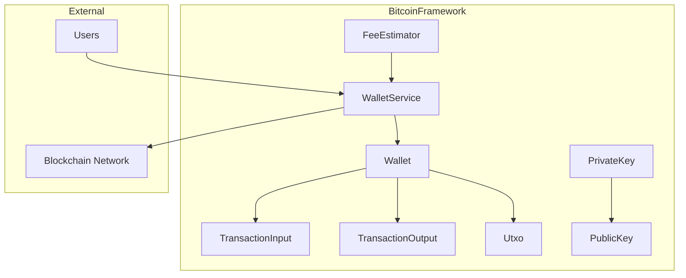
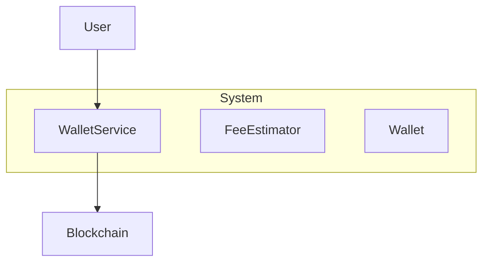
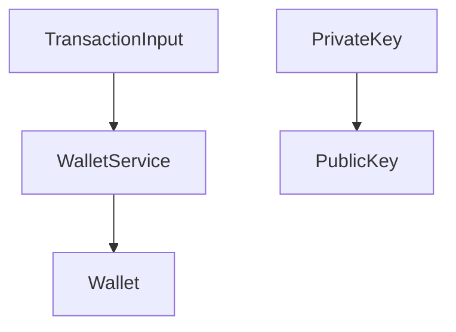
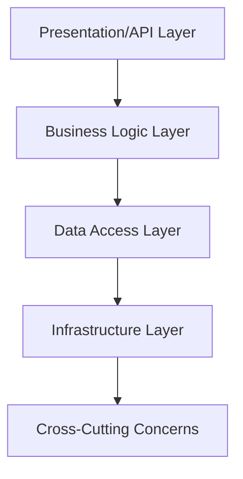
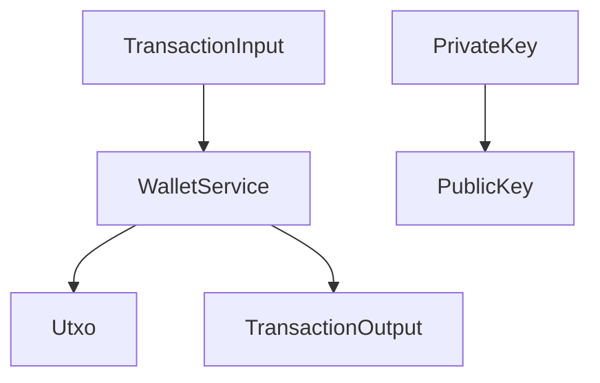
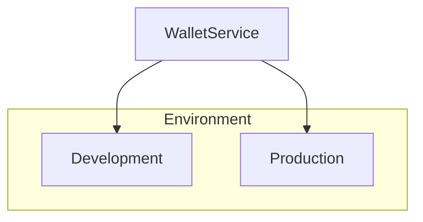

# Architecture Document for Bitcoin Transaction and Wallet Management Framework

## 1. Architecture Overview

### Architectural Style
The architecture follows a **modular design** pattern, emphasizing data encapsulation and separation of concerns. This approach facilitates the management of Bitcoin transactions and wallet operations within a complex cryptocurrency domain.

### Key Architectural Decisions and Rationale
- **Modular Design**: Ensures separation of concerns and facilitates easier maintenance and scalability.
- **Data Encapsulation**: Provides security and integrity for transaction and wallet data.
- **Service-Oriented Architecture**: Enables efficient handling of wallet services and fee estimation.

### High-Level Architecture Diagram

## 2. System Context

### System Boundaries
The system is bounded by its interaction with external users and the blockchain network, focusing on transaction management and wallet operations.

### External Actors and Systems
- **Users**: Interact with the system to manage wallets and execute transactions.
- **Blockchain Network**: Provides the infrastructure for transaction validation and execution.

### Communication Protocols
- **HTTP/HTTPS**: Used for user interactions with the wallet service.
- **Blockchain Protocols**: Used for communication with the Bitcoin network.

### System Context Diagram

## 3. Component Architecture

### Bitcoin Transaction Input Representation Module
- **Component Name**: TransactionInput
- **Responsibilities**: Encapsulates transaction input details for validation and execution.
- **Technology Choices**: Kotlin data class for structured data representation.
- **Deployment Characteristics**: Deployed as part of the core transaction processing framework.
- **Scaling Strategy**: Scales horizontally with increased transaction volume.

### Bitcoin Wallet and Transaction Management
- **Component Name**: WalletService
- **Responsibilities**: Manages wallet lifecycle, including creation, fund reception, and fund sending.
- **Technology Choices**: Kotlin service class for business logic encapsulation.
- **Deployment Characteristics**: Deployed as a standalone service within the framework.
- **Scaling Strategy**: Scales horizontally with increased user demand.

### Bitcoin Key Management: Private and Public Key Operations
- **Component Name**: PrivateKey/PublicKey
- **Responsibilities**: Handles cryptographic key generation and conversion.
- **Technology Choices**: Kotlin classes utilizing SecureRandom for secure key generation.
- **Deployment Characteristics**: Integrated within the transaction processing framework.
- **Scaling Strategy**: Scales with increased cryptographic operations.

### Component Architecture Diagram

## 4. Layer Architecture

### Presentation/API Layer
- **Responsibilities**: Provides interfaces for user interaction and API endpoints for wallet services.
- **Technology Choices**: RESTful API using HTTP/HTTPS.

### Business Logic Layer
- **Responsibilities**: Encapsulates transaction processing and wallet management logic.
- **Technology Choices**: Kotlin service classes.

### Data Access Layer
- **Responsibilities**: Manages data persistence and retrieval for transactions and wallets.
- **Technology Choices**: In-memory data structures for UTXOs and transaction outputs.

### Infrastructure Layer
- **Responsibilities**: Provides underlying infrastructure for cryptographic operations and blockchain interactions.
- **Technology Choices**: SecureRandom for cryptographic security.

### Cross-Cutting Concerns
- **Logging**: Integrated logging for transaction and wallet operations.
- **Security**: Cryptographic key management and secure transaction processing.
- **Monitoring**: Real-time monitoring of transaction and wallet activities.

### Layer Diagram

## 5. Data Architecture

### Data Stores and Their Purposes
- **UTXO Store**: Tracks unspent transaction outputs for wallet balance management.
- **Transaction Store**: Records transaction inputs and outputs for validation and execution.

### Data Flow Diagram

### Caching Strategy
- **In-memory Caching**: Used for frequently accessed UTXOs and transaction data.

### Data Consistency Model
- **Eventual Consistency**: Ensures data consistency across distributed components.

## 6. Integration Architecture

### Synchronous Integrations
- **APIs**: RESTful API for wallet services.
- **RPC**: Remote procedure calls for transaction processing.

### Asynchronous Integrations
- **Queues**: Message queues for transaction processing events.
- **Events**: Event-driven architecture for transaction lifecycle management.

### Integration Patterns Used
- **Service-Oriented Integration**: Facilitates modular and scalable service interactions.

## 7. Security Architecture

### Authentication Architecture
- **OAuth2**: Used for secure user authentication.

### Authorization Architecture
- **Role-Based Access Control**: Ensures secure access to wallet and transaction services.

### Network Security
- **TLS/SSL**: Secures communication between users and services.

### Data Security
- **Encryption**: Utilizes cryptographic keys for secure transaction processing.

## 8. Deployment Architecture

### Deployment Topology
- **Microservices**: Deployed as independent services for wallet and transaction management.

### Environment Configurations
- **Development**: Local environment for testing and development.
- **Production**: Cloud-based deployment for scalability and reliability.

### Infrastructure Requirements
- **Cloud Infrastructure**: Supports scalable and secure deployment.

### CI/CD Pipeline Architecture
- **Automated Testing**: Ensures code quality and reliability.
- **Continuous Deployment**: Facilitates rapid deployment of updates.

### Deployment Topology Diagram

## 9. Operational Architecture

### Monitoring and Alerting
- **Real-Time Monitoring**: Tracks transaction and wallet activities.
- **Alerts**: Notifies on critical events and anomalies.

### Logging Strategy
- **Centralized Logging**: Aggregates logs for transaction and wallet operations.

### Health Checks
- **Periodic Health Checks**: Ensures service availability and performance.

### Disaster Recovery
- **Backup and Restore**: Provides mechanisms for data recovery in case of failures.

## 10. Architecture Decision Records (ADRs)

### ADR 1: Modular Design
- **Context**: Need for scalable and maintainable architecture.
- **Decision**: Adopt modular design pattern.
- **Rationale**: Facilitates separation of concerns and easier maintenance.
- **Consequences**: Improved scalability and reduced complexity.

### ADR 2: Secure Key Management
- **Context**: Requirement for secure cryptographic operations.
- **Decision**: Utilize SecureRandom for key generation.
- **Rationale**: Ensures cryptographic security and integrity.
- **Consequences**: Enhanced security for transaction processing.

### ADR 3: Service-Oriented Architecture
- **Context**: Need for efficient wallet and transaction management.
- **Decision**: Implement service-oriented architecture.
- **Rationale**: Supports modular and scalable service interactions.
- **Consequences**: Improved efficiency and reliability of services.

This architecture document outlines the comprehensive design and operational strategies for the Bitcoin transaction and wallet management framework, ensuring secure, scalable, and efficient operations within the cryptocurrency domain.