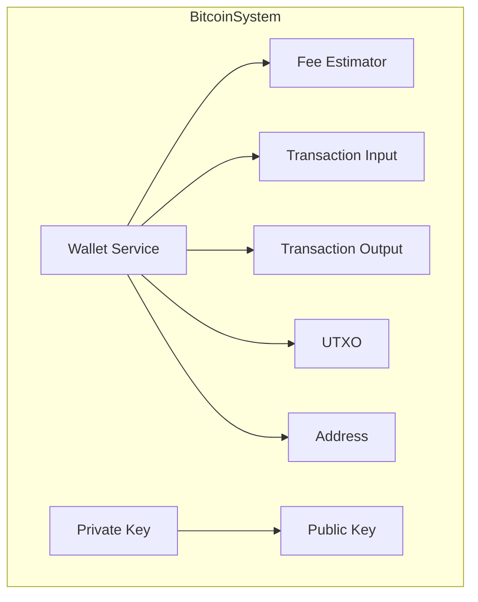
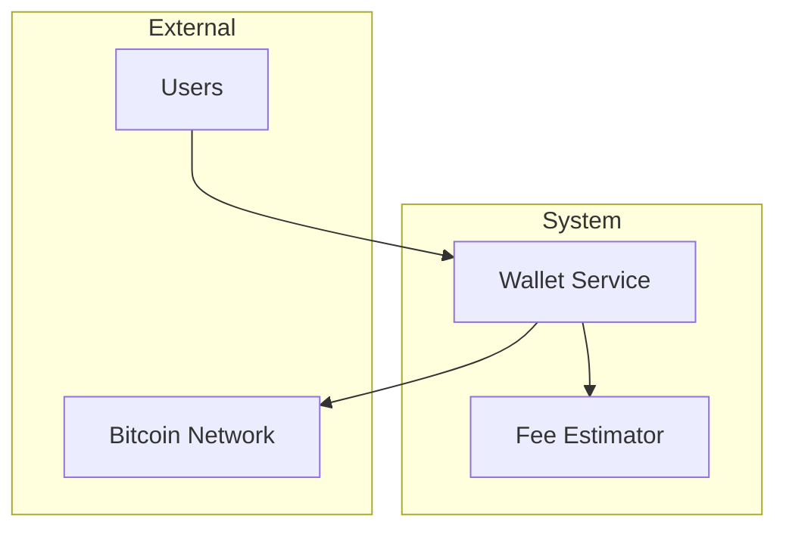
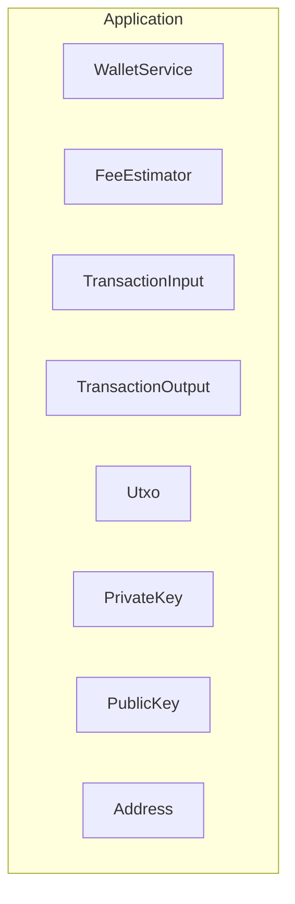
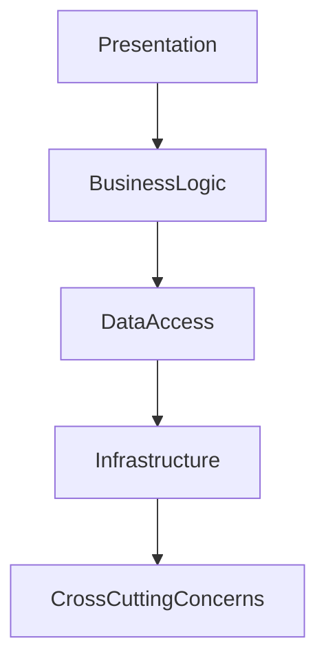
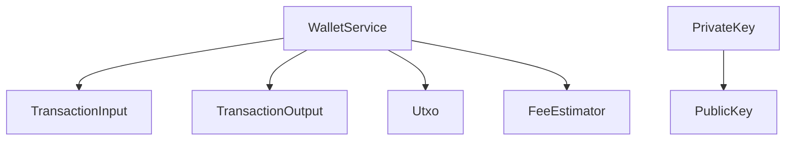
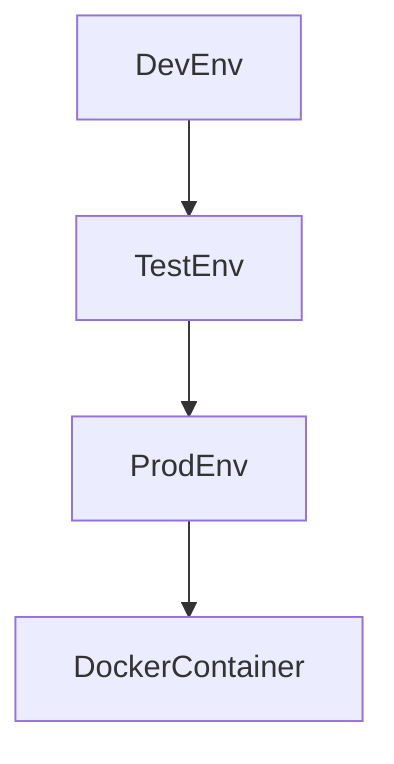

# Architecture Document for Bitcoin Transaction and Wallet Management System

## 1. Architecture Overview

### Architectural Style
The architecture of the Bitcoin Transaction and Wallet Management System follows a **modular monolith** style. This approach allows for clear separation of concerns within the codebase, facilitating maintenance and scalability while keeping the system cohesive.

### Key Architectural Decisions and Rationale
- **Modular Monolith**: Chosen to balance between simplicity and scalability. This style allows for easy integration and testing while maintaining performance.
- **Kotlin**: Selected for its concise syntax and interoperability with Java, making it suitable for modern application development.
- **SecureRandom**: Utilized for cryptographic operations to ensure security in key generation.

### High-Level Architecture Diagram

## 2. System Context

### System Boundaries
The system is designed to manage Bitcoin transactions and wallets, operating within the boundaries of cryptocurrency transaction processing.

### External Actors and Systems
- **Users**: Interact with the system to manage wallets and perform transactions.
- **Bitcoin Network**: External system for transaction validation and execution.

### Communication Protocols
- **HTTP/HTTPS**: Used for API communication with external services.
- **JSON**: Format for data exchange between components.

### System Context Diagram

## 3. Component Architecture

### Bitcoin Transaction Input Representation Module
- **Component Name**: TransactionInput
- **Responsibilities**: Encapsulates transaction input details for Bitcoin transactions.
- **Technology Choices**: Kotlin data class for structured data representation.
- **Deployment Characteristics**: Part of the core application module.
- **Scaling Strategy**: Scales with the application; no separate scaling needed.

### Bitcoin Wallet and Transaction Management
- **Component Name**: WalletService
- **Responsibilities**: Manages wallet operations including creation, fund reception, and fund sending.
- **Technology Choices**: Kotlin service class for business logic encapsulation.
- **Deployment Characteristics**: Deployed within the application server.
- **Scaling Strategy**: Horizontal scaling through application server replication.

### Bitcoin Key Management: Private and Public Key Operations
- **Component Name**: PrivateKey and PublicKey
- **Responsibilities**: Handles cryptographic key generation and conversion.
- **Technology Choices**: Kotlin classes utilizing SecureRandom for security.
- **Deployment Characteristics**: Integrated within the application module.
- **Scaling Strategy**: Scales with application; cryptographic operations are lightweight.

### Component/Container Diagram

## 4. Layer Architecture

### Presentation/API Layer
- **Responsibilities**: Exposes APIs for wallet and transaction management.
- **Technology Choices**: RESTful APIs using HTTP/HTTPS.
- **Dependencies**: Depends on business logic layer for operations.

### Business Logic Layer
- **Responsibilities**: Implements core logic for transaction processing and wallet management.
- **Technology Choices**: Kotlin service classes.
- **Dependencies**: Interfaces with data access layer for data operations.

### Data Access Layer
- **Responsibilities**: Manages data persistence and retrieval.
- **Technology Choices**: In-memory data structures for transaction and wallet data.
- **Dependencies**: Utilized by business logic layer.

### Infrastructure Layer
- **Responsibilities**: Provides environment configurations and deployment support.
- **Technology Choices**: Docker for containerization.
- **Dependencies**: Supports all other layers.

### Cross-Cutting Concerns
- **Logging**: Integrated logging using Kotlin logging libraries.
- **Security**: SecureRandom for cryptographic operations.
- **Monitoring**: Application performance monitoring tools.

### Layer Diagram

## 5. Data Architecture

### Data Stores and Their Purposes
- **In-memory Data Structures**: Used for storing wallet and transaction data temporarily.

### Data Flow Diagram

### Caching Strategy
- **In-memory Caching**: Utilized for quick access to frequently used data.

### Data Consistency Model
- **Eventual Consistency**: Ensures data consistency across transactions and wallet operations.

## 6. Integration Architecture

### Synchronous Integrations
- **APIs**: RESTful APIs for wallet and transaction operations.

### Asynchronous Integrations
- **Events**: Event-driven architecture for transaction updates.

### Integration Patterns Used
- **Request-Response**: For API interactions.
- **Event Notification**: For asynchronous updates.

## 7. Security Architecture

### Authentication Architecture
- **SecureRandom**: Used for secure key generation.

### Authorization Architecture
- **Role-based Access Control**: Ensures only authorized users can perform transactions.

### Network Security
- **HTTPS**: Secures data in transit.

### Data Security
- **Encryption**: Cryptographic operations ensure data security.

## 8. Deployment Architecture

### Deployment Topology
- **Docker Containers**: Application deployed in containerized environments.

### Environment Configurations
- **Development, Testing, Production**: Separate configurations for each environment.

### Infrastructure Requirements
- **Cloud-based Servers**: For scalability and reliability.

### CI/CD Pipeline Architecture
- **Automated Testing and Deployment**: Ensures code quality and rapid deployment.

### Deployment Topology Diagram

## 9. Operational Architecture

### Monitoring and Alerting
- **Application Monitoring Tools**: For performance tracking.

### Logging Strategy
- **Centralized Logging**: Using logging frameworks.

### Health Checks
- **Automated Health Checks**: For system components.

### Disaster Recovery
- **Backup and Restore Procedures**: Ensures data integrity.

## 10. Architecture Decision Records (ADRs)

### ADR 1: Modular Monolith Architecture
- **Context**: Need for a scalable yet simple architecture.
- **Decision**: Adopted modular monolith architecture.
- **Rationale**: Balances simplicity and scalability.
- **Consequences**: Easier integration and maintenance.

### ADR 2: Kotlin for Development
- **Context**: Choosing a programming language.
- **Decision**: Selected Kotlin.
- **Rationale**: Concise syntax and Java interoperability.
- **Consequences**: Modern development practices.

### ADR 3: SecureRandom for Cryptographic Operations
- **Context**: Ensuring secure key generation.
- **Decision**: Use SecureRandom.
- **Rationale**: Provides cryptographic security.
- **Consequences**: Enhanced security for key operations.

This document outlines the architecture for the Bitcoin Transaction and Wallet Management System, detailing components, layers, data flow, and operational strategies. Further context may be required for specific sections.