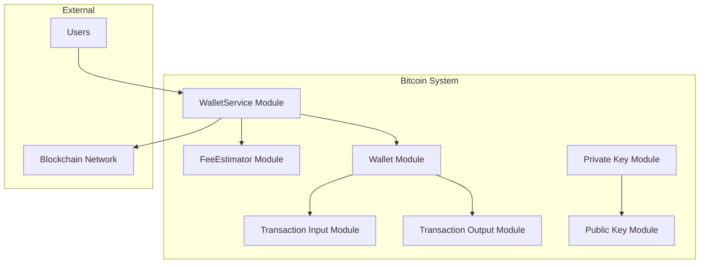
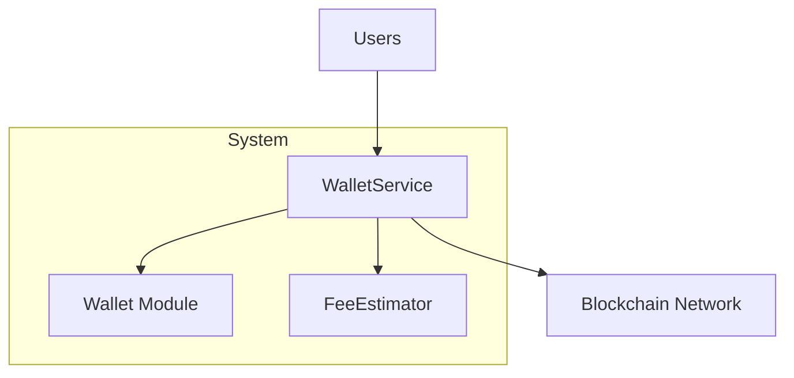
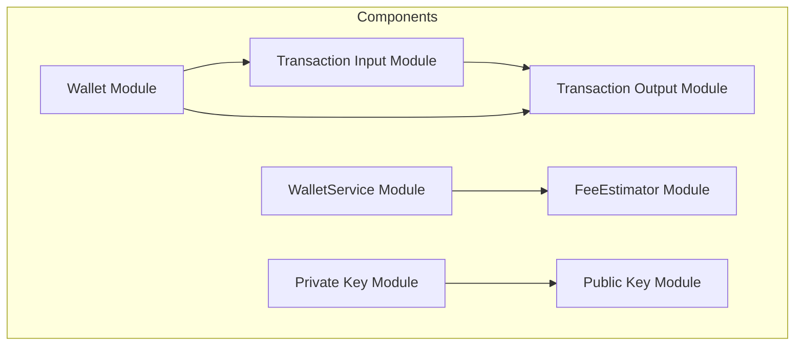
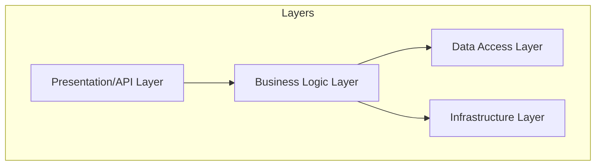
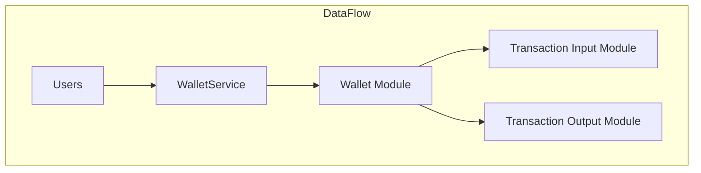
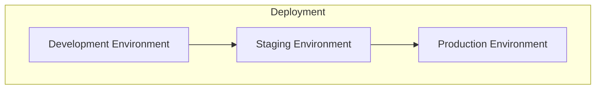
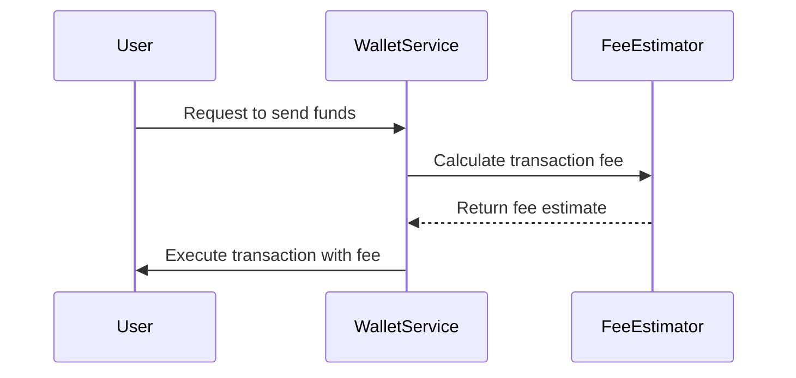

# Architecture Document for Cryptocurrency and Blockchain Technology Application

## 1. Architecture Overview

### Architectural Style
The architecture of this application follows a **modular design** pattern, leveraging object-oriented principles to encapsulate data and operations within discrete modules and classes. This approach ensures maintainability, scalability, and clear separation of concerns across the system.

### Key Architectural Decisions and Rationale
- **Modular Design**: Chosen to facilitate independent development and testing of components, enhancing maintainability and scalability.
- **Data Encapsulation**: Ensures data integrity and security, crucial for handling sensitive cryptocurrency transactions.
- **Service-Oriented Architecture**: Implemented for wallet and transaction management to streamline operations and enhance user experience.
- **Secure Key Management**: Utilizes cryptographic principles to safeguard private and public keys, ensuring transaction security.

### High-Level Architecture Diagram

## 2. System Context

### System Boundaries
The system is bounded by its interaction with external users and the blockchain network, facilitating transactions and wallet management.

### External Actors and Systems
- **Users**: Interact with the system to manage wallets and execute transactions.
- **Blockchain Network**: Serves as the ledger for recording and verifying transactions.

### Communication Protocols
- **HTTP/HTTPS**: Used for API interactions with users.
- **Blockchain Protocols**: Utilized for transaction verification and recording on the blockchain.

### System Context Diagram

## 3. Component Architecture

### Bitcoin Transaction Input Representation Module
- **Component Name**: Transaction Input Module
- **Responsibilities**: Encapsulates transaction input details, including source transaction ID, index, and script signature.
- **Technology Choices and Rationale**: Kotlin data class for efficient data handling and encapsulation.
- **Deployment Characteristics**: Deployed as part of the core transaction processing framework.
- **Scaling Strategy**: Horizontal scaling by replicating modules across multiple instances.

### Bitcoin Wallet and Transaction Management
- **Component Name**: Wallet Module
- **Responsibilities**: Manages Bitcoin addresses, transaction outputs, UTXOs, and wallet functionalities.
- **Technology Choices and Rationale**: Kotlin data classes for structured data representation and encapsulation.
- **Deployment Characteristics**: Deployed as a service-oriented component for wallet management.
- **Scaling Strategy**: Vertical scaling to accommodate increased transaction volume.

### Bitcoin Key Management: Private and Public Key Operations
- **Component Name**: Private Key Module
- **Responsibilities**: Generates private keys and converts them to public keys.
- **Technology Choices and Rationale**: SecureRandom for cryptographic security.
- **Deployment Characteristics**: Deployed as a security-focused module.
- **Scaling Strategy**: Horizontal scaling to ensure redundancy and security.

### Component Diagram

## 4. Layer Architecture

### Presentation/API Layer
- **Responsibilities**: Interfaces with users for wallet and transaction management.
- **Dependencies**: WalletService, FeeEstimator

### Business Logic Layer
- **Responsibilities**: Processes transactions, manages wallets, estimates fees.
- **Dependencies**: Wallet Module, FeeEstimator Module

### Data Access Layer
- **Responsibilities**: Handles data storage and retrieval for transaction inputs and outputs.
- **Dependencies**: Transaction Input Module, Transaction Output Module

### Infrastructure Layer
- **Responsibilities**: Provides cryptographic operations and key management.
- **Dependencies**: Private Key Module, Public Key Module

### Cross-Cutting Concerns
- **Logging**: Integrated across all modules for transaction tracking.
- **Security**: Ensures secure key management and transaction verification.
- **Monitoring**: Monitors transaction processing and wallet activities.

### Layer Diagram

## 5. Data Architecture

### Data Stores and Their Purposes
- **Transaction Data Store**: Holds transaction inputs and outputs.
- **Wallet Data Store**: Manages wallet information and UTXOs.

### Data Flow Diagram

### Caching Strategy
- **In-Memory Caching**: Used for frequently accessed transaction data to improve performance.

### Data Consistency Model
- **Eventual Consistency**: Ensures data consistency across distributed modules.

## 6. Integration Architecture

### Synchronous Integrations
- **APIs**: Used for real-time transaction processing and wallet management.

### Asynchronous Integrations
- **Queues**: Utilized for transaction verification and processing.

### Integration Patterns Used
- **Request-Response**: For synchronous API interactions.
- **Event-Driven**: For asynchronous transaction processing.

## 7. Security Architecture

### Authentication Architecture
- **OAuth2**: Used for user authentication and authorization.

### Authorization Architecture
- **Role-Based Access Control (RBAC)**: Ensures secure access to wallet and transaction functionalities.

### Network Security
- **TLS/SSL**: Secures communication between users and the system.

### Data Security
- **Encryption**: Ensures secure storage and transmission of private keys and transaction data.

## 8. Deployment Architecture

### Deployment Topology
- **Microservices**: Deployed across multiple instances for scalability and redundancy.

### Environment Configurations
- **Development, Staging, Production**: Separate environments for testing and deployment.

### Infrastructure Requirements
- **Cloud-Based**: Utilizes cloud infrastructure for scalability and reliability.

### CI/CD Pipeline Architecture
- **Automated Testing and Deployment**: Ensures continuous integration and delivery.

### Deployment Topology Diagram

## 9. Operational Architecture

### Monitoring and Alerting
- **Real-Time Monitoring**: Tracks transaction processing and system health.

### Logging Strategy
- **Centralized Logging**: Aggregates logs for analysis and troubleshooting.

### Health Checks
- **Automated Health Checks**: Regularly checks system components for availability.

### Disaster Recovery
- **Backup and Restore**: Ensures data integrity and system recovery.

## 10. Architecture Decision Records (ADRs)

### ADR Example
- **Context**: Need for secure key management in the Bitcoin framework.
- **Decision**: Utilize SecureRandom for generating private keys.
- **Rationale**: Ensures cryptographic security and uniqueness of keys.
- **Consequences**: Enhanced security and integrity of Bitcoin transactions.

### Sequence Diagram for Key Flow

[Requires additional context]