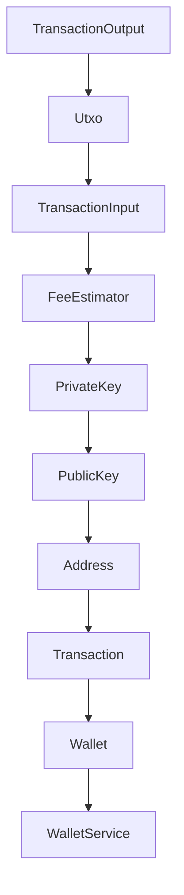
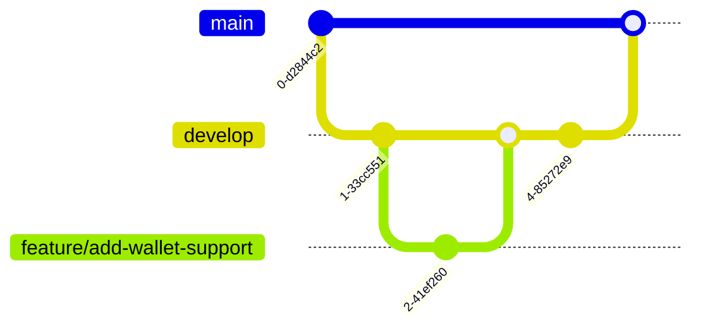
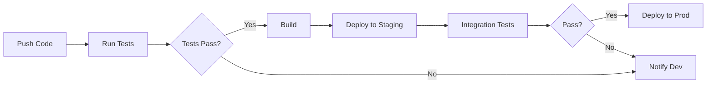
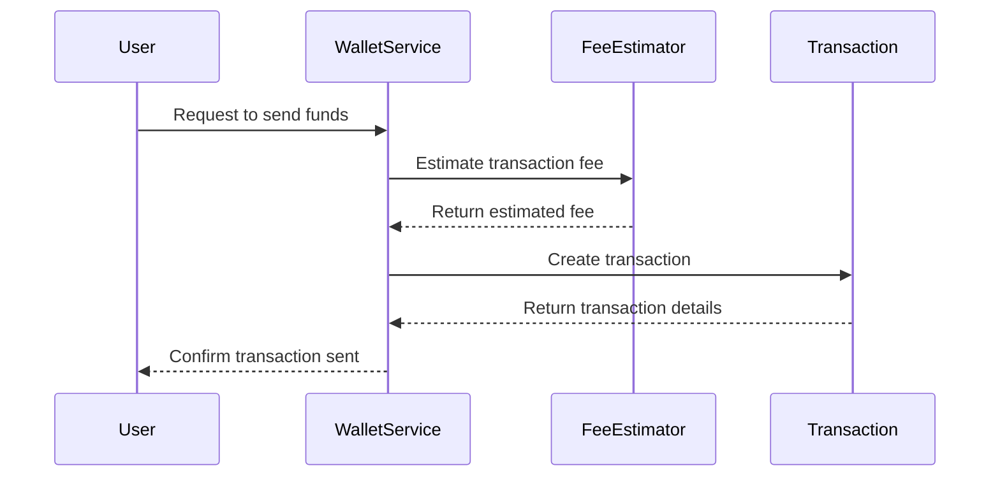

# Developer Guide for Bitcoin Transaction and Wallet Management Framework

Welcome to the Developer Guide for our Bitcoin Transaction and Wallet Management Framework. This guide is designed to help new developers onboard quickly and understand the intricacies of our codebase, which is focused on managing Bitcoin transactions and wallets.

## 1. Getting Started

### Prerequisites
- **Java Development Kit (JDK) 11 or higher**: Ensure you have the JDK installed on your machine.
- **Kotlin 1.5 or higher**: Our codebase is written in Kotlin, so ensure you have the appropriate version installed.
- **Git**: Version control system for managing code changes.
- **Gradle**: Build tool used for managing dependencies and building the project.

### Environment Setup
1. **Install JDK**: Download and install the latest JDK from [Oracle](https://www.oracle.com/java/technologies/javase-jdk11-downloads.html) or [OpenJDK](https://openjdk.java.net/).
2. **Install Kotlin**: Follow the instructions on the [Kotlin website](https://kotlinlang.org/docs/command-line.html) to set up Kotlin.
3. **Install Git**: Download and install Git from [git-scm.com](https://git-scm.com/).
4. **Install Gradle**: Follow the instructions on the [Gradle website](https://gradle.org/install/) to set up Gradle.

### Quick Start Guide
1. **Clone the Repository**:
   ```bash
   git clone https://github.com/your-repo/bitcoin-framework.git
   cd bitcoin-framework
   ```
2. **Build the Project**:
   ```bash
   ./gradlew build
   ```
3. **Run Tests**:
   ```bash
   ./gradlew test
   ```

### Hello World Example
Here's a simple example to create a Bitcoin wallet and estimate a transaction fee:
```kotlin
import com.example.bitcoin.WalletService
import com.example.bitcoin.FeeEstimator

fun main() {
    val walletService = WalletService()
    val wallet = walletService.createWallet("My Bitcoin Wallet")
    println("Created wallet with address: ${wallet.address}")

    val feeEstimator = FeeEstimator()
    val estimatedFee = feeEstimator.estimateFee(250, 10)
    println("Estimated transaction fee: $estimatedFee satoshis")
}
```

## 2. Development Environment

### IDE Recommendations
- **IntelliJ IDEA**: Highly recommended for Kotlin development due to its robust support and features.
- **Visual Studio Code**: With the Kotlin plugin, it can also be used effectively.

### Required Tools
- **Docker**: For containerized development and testing.
- **Postman**: For testing API endpoints.

### Environment Variables
- `BITCOIN_NETWORK`: Set to `mainnet`, `testnet`, or `regtest` depending on the environment.
- `DATABASE_URL`: Connection string for the database.
- `API_KEY`: Key for accessing external Bitcoin services.

### Local Development Setup
1. **Configure Environment Variables**:
   - Create a `.env` file in the project root and add your environment variables.
2. **Start Local Services**:
   - Use Docker to start any required services, such as a local Bitcoin node or database.

## 3. Project Structure

### Directory Layout
```
/src
  /main
    /kotlin
      /com/example/bitcoin
        TransactionOutput.kt
        Utxo.kt
        TransactionInput.kt
        FeeEstimator.kt
        PrivateKey.kt
        PublicKey.kt
        Address.kt
        Transaction.kt
        Wallet.kt
        WalletService.kt
  /test
    /kotlin
      /com/example/bitcoin
        TransactionTest.kt
        WalletServiceTest.kt
```

### Key Files and Their Purposes
- **TransactionOutput.kt**: Defines the `TransactionOutput` data class.
- **Utxo.kt**: Represents unspent transaction outputs.
- **TransactionInput.kt**: Defines the `TransactionInput` data class.
- **FeeEstimator.kt**: Contains logic for estimating transaction fees.
- **PrivateKey.kt**: Manages private key operations.
- **PublicKey.kt**: Represents public keys.
- **Address.kt**: Validates and represents Bitcoin addresses.
- **Transaction.kt**: Models a Bitcoin transaction.
- **Wallet.kt**: Manages wallet operations and UTXOs.
- **WalletService.kt**: Provides services for wallet management.

### Naming Conventions
- **Classes and Objects**: PascalCase (e.g., `TransactionOutput`)
- **Methods and Variables**: camelCase (e.g., `estimateFee`)
- **Constants**: UPPER_SNAKE_CASE (e.g., `MAX_TRANSACTION_SIZE`)

### Code Organization Principles
- **Modular Design**: Each module should encapsulate a specific functionality.
- **Separation of Concerns**: Keep business logic separate from data representation.

### Module Dependency Diagram


## 4. Development Workflow

### Git Workflow
- **Main Branch**: `main`
- **Development Branch**: `develop`
- **Feature Branches**: `feature/<feature-name>`
- **Bugfix Branches**: `bugfix/<issue-id>`

### Branch Naming
- Use descriptive names for branches, e.g., `feature/add-wallet-support`.

### Commit Conventions
- Use [Conventional Commits](https://www.conventionalcommits.org/):
  - `feat`: A new feature
  - `fix`: A bug fix
  - `docs`: Documentation changes
  - `style`: Code style changes (formatting, missing semi-colons, etc.)
  - `refactor`: Code changes that neither fix a bug nor add a feature

### Code Review Process
- Open a pull request against the `develop` branch.
- At least one approval from a senior developer is required.
- Ensure all tests pass before merging.

### CI/CD Pipeline
- **Continuous Integration**: Automated tests run on every push.
- **Continuous Deployment**: Deploy to staging on successful test completion.

### Git Workflow Diagram


## 5. Coding Standards

### Style Guide
- Follow the [Kotlin Coding Conventions](https://kotlinlang.org/docs/coding-conventions.html).
- Use 4 spaces for indentation.

### Best Practices
- Write unit tests for all new features.
- Keep functions small and focused.
- Use `data class` for simple data structures.

### Anti-patterns to Avoid
- Avoid large monolithic classes.
- Do not hard-code values; use configuration files or environment variables.

### Documentation Requirements
- All public methods should have KDoc comments.
- Update README files for any significant changes.

## 6. Testing Guide

### Test Types and Strategy
- **Unit Tests**: Test individual components.
- **Integration Tests**: Test interactions between components.

### How to Write Tests
- Use JUnit for writing tests.
- Place test files in the `src/test/kotlin` directory.

### How to Run Tests
```bash
./gradlew test
```

### Coverage Requirements
- Aim for at least 80% test coverage.

### Mocking and Fixtures
- Use Mockito for mocking dependencies.
- Use JUnit's `@Before` and `@After` annotations for setting up and tearing down test fixtures.

## 7. Debugging Guide

### Debugging Tools
- **IntelliJ IDEA Debugger**: Use breakpoints and step-through debugging.
- **Logcat**: For logging and debugging on Android.

### Common Issues and Solutions
- **NullPointerException**: Ensure all nullable types are handled.
- **Transaction Errors**: Check transaction inputs and outputs for correctness.

### Logging Guidelines
- Use SLF4J for logging.
- Log at appropriate levels: `DEBUG`, `INFO`, `WARN`, `ERROR`.

### Troubleshooting Steps
1. **Reproduce the Issue**: Try to consistently reproduce the problem.
2. **Check Logs**: Look for any error messages or stack traces.
3. **Use Debugger**: Step through the code to find where it deviates from expected behavior.

## 8. Building and Deployment

### Build Process
- Use Gradle to build the project.
- Ensure all dependencies are up-to-date.

### Deployment Process
- Deploy to staging for testing.
- Use a CI/CD pipeline for automated deployments.

### Environment Configurations
- Use environment variables to configure different environments (e.g., `BITCOIN_NETWORK`).

### Release Procedures
- Tag releases in Git with the version number.
- Update the changelog with new features and bug fixes.

## 9. Contributing

### How to Contribute
- Fork the repository and create a feature branch.
- Follow the coding standards and commit conventions.

### Issue Reporting
- Use GitHub Issues to report bugs or request features.
- Provide detailed steps to reproduce any bugs.

### Pull Request Process
- Ensure your branch is up-to-date with `develop`.
- Open a pull request and request a review from a senior developer.

### Code of Conduct
- Be respectful and considerate in all communications.
- Follow the project's code of conduct as outlined in the `CODE_OF_CONDUCT.md` file.

## Mermaid Diagram Requirements

### CI/CD Pipeline Diagram


### Request Handling Flow (Sequence Diagram)


This guide should provide you with a comprehensive understanding of our Bitcoin Transaction and Wallet Management Framework. Welcome to the team, and happy coding!