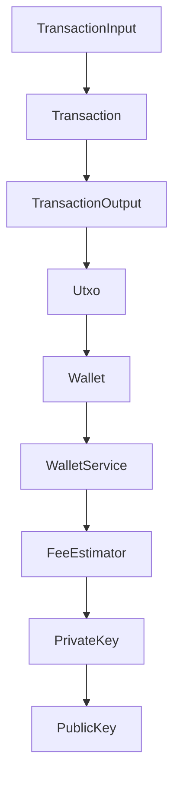
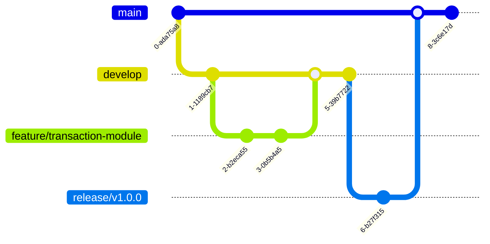
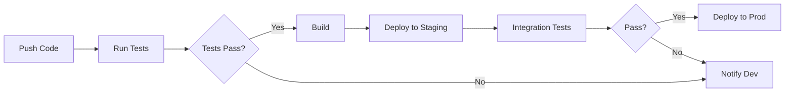
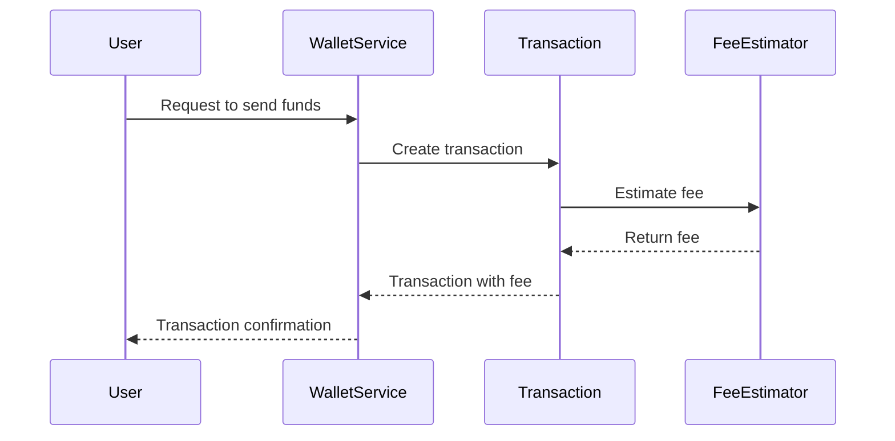

# Developer Guide

Welcome to the Developer Guide for our Bitcoin transaction and wallet management application. This guide will help you get started with the codebase, understand its structure, and follow best practices for development and contribution.

## 1. Getting Started

### Prerequisites
- **Java Development Kit (JDK)**: Ensure you have JDK 11 or higher installed.
- **Kotlin**: The codebase is written in Kotlin, so familiarity with Kotlin is beneficial.
- **Git**: Version control is managed using Git.
- **Gradle**: The project uses Gradle for build automation.

### Environment Setup
1. **Install JDK**: Download and install JDK 11 or higher from [Oracle](https://www.oracle.com/java/technologies/javase-jdk11-downloads.html) or [OpenJDK](https://openjdk.java.net/).
2. **Install Kotlin**: Follow the instructions on the [Kotlin website](https://kotlinlang.org/docs/tutorials/command-line.html) to set up Kotlin.
3. **Install Git**: Download and install Git from [Git's official site](https://git-scm.com/).
4. **Install Gradle**: Follow the setup guide on the [Gradle website](https://gradle.org/install/).

### Quick Start Guide
1. **Clone the Repository**: 
   ```bash
   git clone https://github.com/your-repo/bitcoin-wallet.git
   cd bitcoin-wallet
   ```
2. **Build the Project**:
   ```bash
   ./gradlew build
   ```
3. **Run Tests**:
   ```bash
   ./gradlew test
   ```

### Hello World Example
To ensure your setup is correct, you can run a simple "Hello World" program in Kotlin:
```kotlin
fun main() {
    println("Hello, Bitcoin World!")
}
```

## 2. Development Environment

### IDE Recommendations
- **IntelliJ IDEA**: Highly recommended for Kotlin development due to its robust Kotlin support.
- **Visual Studio Code**: With the Kotlin plugin, it can be a lightweight alternative.

### Required Tools
- **Docker**: For containerized development and testing.
- **Postman**: For testing API endpoints.

### Environment Variables
- `BITCOIN_NETWORK`: Set to `mainnet` or `testnet` depending on the environment.
- `WALLET_DB_URL`: Database URL for wallet data storage.

### Local Development Setup
1. **Configure Environment Variables**: Set up the necessary environment variables in your IDE or terminal.
2. **Run Docker**: If using Docker, ensure your containers are running:
   ```bash
   docker-compose up
   ```

## 3. Project Structure

### Directory Layout
```
src/
  main/
    kotlin/
      com/
        example/
          bitcoin/
            Address.kt
            FeeEstimator.kt
            PrivateKey.kt
            PublicKey.kt
            Transaction.kt
            TransactionInput.kt
            TransactionOutput.kt
            Utxo.kt
            Wallet.kt
            WalletService.kt
  test/
    kotlin/
      com/
        example/
          bitcoin/
            AddressTest.kt
            WalletServiceTest.kt
```

### Key Files and Their Purposes
- **Address.kt**: Defines the Bitcoin address class.
- **FeeEstimator.kt**: Contains logic for estimating transaction fees.
- **PrivateKey.kt**: Manages private key operations.
- **PublicKey.kt**: Represents public keys.
- **Transaction.kt**: Models a Bitcoin transaction.
- **Wallet.kt**: Manages wallet operations and UTXOs.

### Naming Conventions
- **Classes**: PascalCase (e.g., `TransactionInput`)
- **Methods**: camelCase (e.g., `estimateFee`)
- **Variables**: camelCase (e.g., `secureRandom`)

### Code Organization Principles
- **Modularity**: Each module should encapsulate a single responsibility.
- **Encapsulation**: Use private access modifiers where applicable to protect data.

### Module Dependency Diagram


## 4. Development Workflow

### Git Workflow
- **Feature Branches**: Create a new branch for each feature or bug fix.
- **Main Branch**: The stable branch for production-ready code.
- **Develop Branch**: The integration branch for features.

### Branch Naming
- **Features**: `feature/short-description`
- **Bugs**: `bugfix/short-description`
- **Hotfixes**: `hotfix/short-description`

### Commit Conventions
- **Format**: `<type>(<scope>): <subject>`
- **Types**: `feat`, `fix`, `docs`, `style`, `refactor`, `test`, `chore`

### Code Review Process
1. **Pull Request**: Submit a pull request to the `develop` branch.
2. **Review**: At least one team member must review and approve.
3. **Merge**: After approval, merge into `develop`.

### CI/CD Pipeline
- **Continuous Integration**: Automated tests run on each pull request.
- **Continuous Deployment**: Deployments to staging are automated after tests pass.

### Git Workflow Diagram


## 5. Coding Standards

### Style Guide
- **Indentation**: Use 4 spaces.
- **Line Length**: Maximum 100 characters.
- **Braces**: Use K&R style.

### Best Practices
- **Error Handling**: Use exceptions for error handling.
- **Logging**: Use structured logging with context.

### Anti-patterns to Avoid
- **Magic Numbers**: Avoid using hard-coded numbers.
- **God Classes**: Avoid classes that handle too many responsibilities.

### Documentation Requirements
- **Comments**: Use Javadoc/KDoc for public methods and classes.
- **README**: Update the README with any new features or changes.

## 6. Testing Guide

### Test Types and Strategy
- **Unit Tests**: Test individual components.
- **Integration Tests**: Test interactions between components.

### How to Write Tests
- **Framework**: Use JUnit for testing.
- **Naming**: `should<ExpectedBehavior>When<Condition>`

### How to Run Tests
```bash
./gradlew test
```

### Coverage Requirements
- **Minimum Coverage**: 80% for all new code.

### Mocking and Fixtures
- **Mocking**: Use Mockito for mocking dependencies.
- **Fixtures**: Use setup methods to initialize common test data.

## 7. Debugging Guide

### Debugging Tools
- **IntelliJ Debugger**: Use for stepping through code.
- **Logcat**: For viewing logs.

### Common Issues and Solutions
- **NullPointerException**: Check for null before accessing objects.
- **Transaction Errors**: Ensure all inputs and outputs are correctly set.

### Logging Guidelines
- **Levels**: Use `DEBUG`, `INFO`, `WARN`, `ERROR`.
- **Format**: Include timestamp, level, and message.

### Troubleshooting Steps
1. **Reproduce**: Try to reproduce the issue.
2. **Logs**: Check logs for any errors or warnings.
3. **Debug**: Use the debugger to step through code.

## 8. Building and Deployment

### Build Process
- **Command**: Use Gradle to build the project.
```bash
./gradlew build
```

### Deployment Process
- **Staging**: Deploy to staging for testing.
- **Production**: Deploy to production after staging approval.

### Environment Configurations
- **Staging**: Use testnet configurations.
- **Production**: Use mainnet configurations.

### Release Procedures
1. **Versioning**: Update version numbers.
2. **Changelog**: Update the changelog with new features and fixes.
3. **Tag**: Create a new Git tag for the release.

## 9. Contributing

### How to Contribute
- **Fork**: Fork the repository and clone it locally.
- **Branch**: Create a feature branch for your work.
- **Commit**: Make changes and commit them.
- **Pull Request**: Submit a pull request for review.

### Issue Reporting
- **Format**: Use the issue template provided.
- **Details**: Include steps to reproduce, expected behavior, and screenshots if applicable.

### Pull Request Process
1. **Create**: Open a pull request against the `develop` branch.
2. **Review**: Address any feedback from reviewers.
3. **Merge**: Once approved, the pull request can be merged.

### Code of Conduct
- **Respect**: Treat everyone with respect and professionalism.
- **Inclusivity**: Encourage a diverse and inclusive environment.
- **Collaboration**: Work together to solve problems and improve the codebase.

## CI/CD Pipeline Diagram


## Request Handling Flow


This guide provides a comprehensive overview of the development process for our Bitcoin transaction and wallet management application. For any additional information or clarification, please refer to the codebase or reach out to the development team.