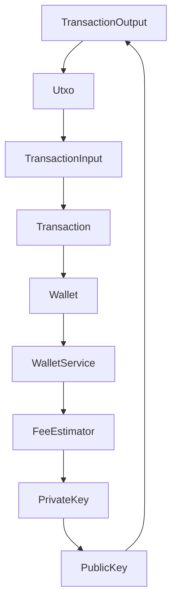
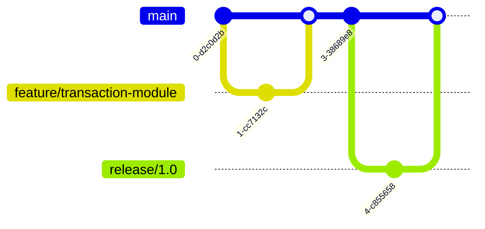
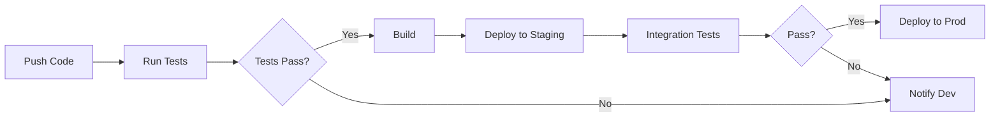
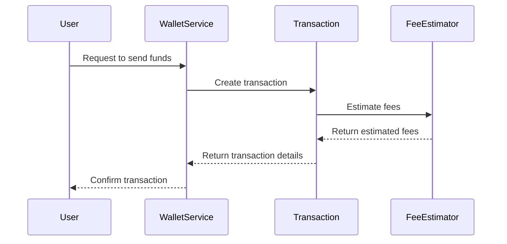

# Developer Guide

## 1. Getting Started

### Prerequisites
- Familiarity with Kotlin programming language
- Basic understanding of Bitcoin transactions and wallet management
- Git installed on your local machine
- Java Development Kit (JDK) 11 or higher

### Environment Setup
1. **Install Kotlin**: Ensure that Kotlin is installed on your system. You can download it from [Kotlin's official website](https://kotlinlang.org/).
2. **Set up JDK**: Install JDK 11 or higher. You can download it from [Oracle's website](https://www.oracle.com/java/technologies/javase-jdk11-downloads.html).
3. **Git**: Ensure Git is installed and configured on your machine. You can download it from [Git's official website](https://git-scm.com/).

### Quick Start Guide
1. **Clone the Repository**:
   ```bash
   git clone <repository-url>
   cd <repository-directory>
   ```
2. **Build the Project**:
   ```bash
   ./gradlew build
   ```

### Hello World Example
To verify your setup, create a simple Kotlin file and run it:
```kotlin
fun main() {
    println("Hello, Bitcoin World!")
}
```

## 2. Development Environment

### IDE Recommendations
- **IntelliJ IDEA**: Highly recommended for Kotlin development due to its robust support for Kotlin and seamless integration with Gradle.

### Required Tools
- **Gradle**: Used for building and managing dependencies.
- **Docker**: For containerized deployment and testing.

### Environment Variables
- `BITCOIN_NETWORK`: Set to `mainnet`, `testnet`, or `regtest` depending on the environment.
- `WALLET_DB_PATH`: Path to the wallet database file.

### Local Development Setup
1. **Configure Environment Variables**:
   ```bash
   export BITCOIN_NETWORK=testnet
   export WALLET_DB_PATH=/path/to/wallet.db
   ```
2. **Run the Application**:
   ```bash
   ./gradlew run
   ```

## 3. Project Structure

### Directory Layout
```
src/
  main/
    kotlin/
      com/
        example/
          bitcoin/
            Address.kt
            FeeEstimator.kt
            PrivateKey.kt
            PublicKey.kt
            Transaction.kt
            TransactionInput.kt
            TransactionOutput.kt
            Utxo.kt
            Wallet.kt
            WalletService.kt
```

### Key Files and Their Purposes
- **Address.kt**: Represents a Bitcoin address with validation.
- **FeeEstimator.kt**: Estimates transaction fees.
- **PrivateKey.kt**: Handles private key operations.
- **PublicKey.kt**: Represents a public key.
- **Transaction.kt**: Represents a Bitcoin transaction.
- **TransactionInput.kt**: Represents an input in a Bitcoin transaction.
- **TransactionOutput.kt**: Represents a transaction output.
- **Utxo.kt**: Represents an Unspent Transaction Output.
- **Wallet.kt**: Manages Bitcoin wallets.
- **WalletService.kt**: Provides wallet management services.

### Naming Conventions
- Classes and modules use PascalCase.
- Methods and variables use camelCase.

### Code Organization Principles
- Follow modular design principles.
- Ensure separation of concerns between different components.

### Module Dependency Diagram


## 4. Development Workflow

### Git Workflow
- **Feature Branching**: Use feature branches for new features.
- **Pull Requests**: Submit pull requests for code reviews.

### Branch Naming
- `feature/<description>`: For new features.
- `bugfix/<description>`: For bug fixes.
- `release/<version>`: For release branches.

### Commit Conventions
- Use clear and concise commit messages.
- Follow the format: `type(scope): description`.

### Code Review Process
- All code changes must be reviewed by at least one other team member.
- Use pull requests for code reviews.

### CI/CD Pipeline
- Automated tests are run on each push.
- Deployments are triggered after successful tests.

### Git Workflow Diagram


## 5. Coding Standards

### Style Guide
- Follow Kotlin coding conventions.
- Use consistent indentation and spacing.

### Best Practices
- Write modular and reusable code.
- Ensure code is well-documented and tested.

### Anti-patterns to Avoid
- Avoid large, monolithic classes.
- Do not hard-code values; use configuration files or environment variables.

### Documentation Requirements
- Document all public classes and methods.
- Use KDoc for documentation.

## 6. Testing Guide

### Test Types and Strategy
- **Unit Tests**: Test individual components.
- **Integration Tests**: Test interactions between components.

### How to Write Tests
- Use JUnit for writing tests.
- Follow the Arrange-Act-Assert pattern.

### How to Run Tests
```bash
./gradlew test
```

### Coverage Requirements
- Aim for at least 80% code coverage.

### Mocking and Fixtures
- Use Mockito for mocking dependencies.
- Use test fixtures for setting up test data.

## 7. Debugging Guide

### Debugging Tools
- **IntelliJ Debugger**: Use for stepping through code.
- **Logcat**: For viewing logs.

### Common Issues and Solutions
- **Transaction Validation Errors**: Check input and output scripts.
- **Fee Calculation Errors**: Verify satoshis per vbyte rate.

### Logging Guidelines
- Use structured logging.
- Log at appropriate levels (INFO, DEBUG, ERROR).

### Troubleshooting Steps
1. Check logs for errors.
2. Verify environment configurations.
3. Reproduce the issue in a test environment.

## 8. Building and Deployment

### Build Process
- Use Gradle for building the project.
- Ensure all tests pass before building.

### Deployment Process
- Deploy to staging environment first.
- Use Docker for containerized deployments.

### Environment Configurations
- Use separate configurations for development, staging, and production.

### Release Procedures
- Tag releases in Git.
- Update version numbers in `build.gradle`.

## 9. Contributing

### How to Contribute
- Fork the repository.
- Create a feature branch.
- Submit a pull request.

### Issue Reporting
- Use GitHub issues for bug reports and feature requests.

### Pull Request Process
- Ensure all tests pass before submitting.
- Provide a clear description of changes.

### Code of Conduct
- Be respectful and constructive in all communications.
- Follow the project's code of conduct guidelines.

## CI/CD Pipeline Diagram


## Request Handling Flow


This guide provides a comprehensive overview of the development process for the Bitcoin transaction and wallet management framework. For any additional details or clarifications, please refer to the specific module documentation or contact the development team.