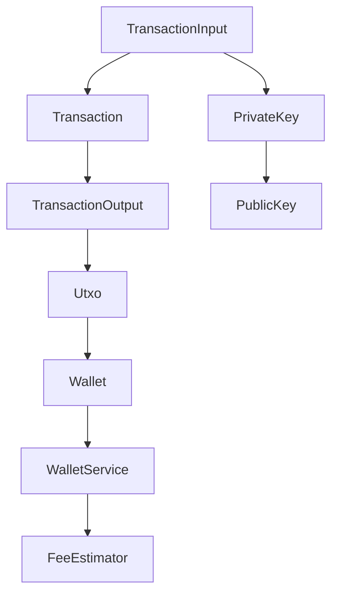
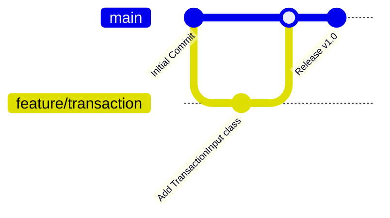
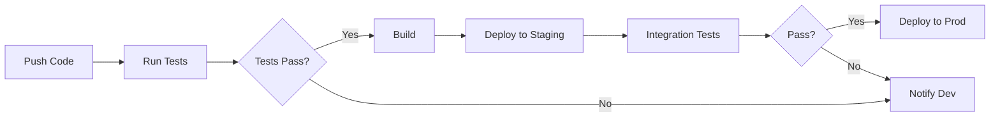
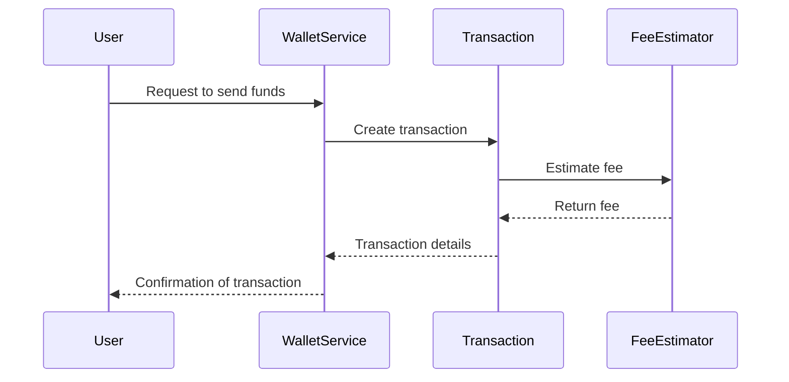

# Developer Guide

Welcome to the Developer Guide for our Cryptocurrency and Blockchain Technology application. This guide is designed to help new team members get up to speed with our codebase, development processes, and best practices.

## 1. Getting Started

### Prerequisites
- Familiarity with Kotlin programming language
- Basic understanding of Bitcoin and blockchain technology
- Git version control system
- JDK 11 or higher

### Environment Setup
1. **Install Java Development Kit (JDK):** Ensure JDK 11 or higher is installed.
2. **Install Git:** Required for version control.
3. **Install an IDE:** IntelliJ IDEA is recommended for Kotlin development.
4. **Clone the Repository:** Use Git to clone the project repository.

### Quick Start Guide
1. Clone the repository:
   ```bash
   git clone https://github.com/your-repo/cryptocurrency-app.git
   ```
2. Open the project in IntelliJ IDEA.
3. Build the project using Gradle:
   ```bash
   ./gradlew build
   ```
4. Run the application:
   ```bash
   ./gradlew run
   ```

### Hello World Example
To verify your setup, create a simple Kotlin file and run a "Hello, World!" program:
```kotlin
fun main() {
    println("Hello, World!")
}
```

## 2. Development Environment

### IDE Recommendations
- **IntelliJ IDEA:** Preferred IDE for Kotlin development due to its robust support and features.

### Required Tools
- **Gradle:** For building and managing dependencies.
- **Docker:** For containerized deployment (if applicable).

### Environment Variables
- **BITCOIN_NETWORK:** Set to `mainnet` or `testnet` depending on the environment.
- **DATABASE_URL:** URL for the database connection.

### Local Development Setup
1. Configure your environment variables.
2. Use Docker for setting up local databases if needed.
3. Run the application locally using the Gradle command.

## 3. Project Structure

### Directory Layout
```
src/
  main/
    kotlin/
      com/example/bitcoin/
        Address.kt
        FeeEstimator.kt
        PrivateKey.kt
        PublicKey.kt
        Transaction.kt
        TransactionInput.kt
        TransactionOutput.kt
        Utxo.kt
        Wallet.kt
        WalletService.kt
```

### Key Files and Their Purposes
- **TransactionInput.kt:** Represents inputs in Bitcoin transactions.
- **TransactionOutput.kt:** Represents outputs in Bitcoin transactions.
- **Wallet.kt:** Manages Bitcoin wallets and UTXOs.
- **FeeEstimator.kt:** Estimates transaction fees.

### Naming Conventions
- Classes and modules use PascalCase.
- Methods and variables use camelCase.

### Code Organization Principles
- Follow modular design principles.
- Encapsulate data using data classes.

### Module Dependency Diagram


## 4. Development Workflow

### Git Workflow
- **Branching Model:** Use feature branches for new features, bugfix branches for fixes, and main for stable releases.

### Branch Naming
- Feature branches: `feature/<feature-name>`
- Bugfix branches: `bugfix/<issue-id>`

### Commit Conventions
- Use clear and concise commit messages.
- Follow the format: `<type>(<scope>): <subject>`

### Code Review Process
- Submit a pull request for each feature or bugfix.
- Ensure at least one team member reviews the code.

### CI/CD Pipeline
- Automated tests run on each push.
- Deployments are triggered after successful tests.

### Git Workflow Diagram


## 5. Coding Standards

### Style Guide
- Follow Kotlin coding conventions.
- Use meaningful names for variables and methods.

### Best Practices
- Write unit tests for all new features.
- Keep methods small and focused.

### Anti-patterns to Avoid
- Avoid large classes with multiple responsibilities.
- Do not hardcode values; use configuration files.

### Documentation Requirements
- Document public methods with Javadoc-style comments.
- Update README with any significant changes.

## 6. Testing Guide

### Test Types and Strategy
- **Unit Tests:** Test individual components.
- **Integration Tests:** Test interactions between components.

### How to Write Tests
- Use JUnit for writing tests.
- Mock dependencies using Mockito.

### How to Run Tests
- Execute tests using Gradle:
  ```bash
  ./gradlew test
  ```

### Coverage Requirements
- Aim for at least 80% code coverage.

### Mocking and Fixtures
- Use Mockito for mocking objects.
- Create fixtures for common test data.

## 7. Debugging Guide

### Debugging Tools
- Use IntelliJ IDEA's built-in debugger.
- Log important events using a logging framework.

### Common Issues and Solutions
- **NullPointerException:** Ensure all objects are initialized.
- **Transaction Errors:** Verify transaction inputs and outputs.

### Logging Guidelines
- Use SLF4J for logging.
- Log at appropriate levels (INFO, DEBUG, ERROR).

### Troubleshooting Steps
1. Check logs for errors.
2. Verify environment configurations.
3. Reproduce the issue with a test case.

## 8. Building and Deployment

### Build Process
- Use Gradle to build the project:
  ```bash
  ./gradlew build
  ```

### Deployment Process
- Deploy using Docker containers.
- Ensure all services are up and running.

### Environment Configurations
- Use environment variables for configuration.
- Separate configurations for development, staging, and production.

### Release Procedures
- Tag releases in Git.
- Update version numbers in build files.

## 9. Contributing

### How to Contribute
- Fork the repository and create a feature branch.
- Submit a pull request with a detailed description.

### Issue Reporting
- Use GitHub issues to report bugs.
- Provide steps to reproduce the issue.

### Pull Request Process
- Ensure all tests pass before submitting.
- Include a clear description of changes.

### Code of Conduct
- Be respectful and constructive in all communications.
- Follow the project's guidelines and standards.

## CI/CD Pipeline Diagram


## Request Handling Flow


This guide provides a comprehensive overview of our development practices and codebase structure. For any additional questions or clarifications, please reach out to your team lead or mentor.