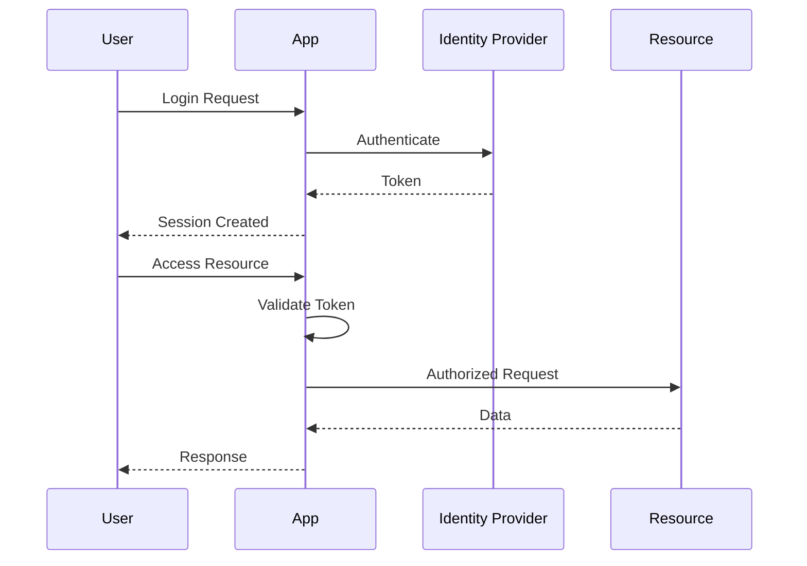
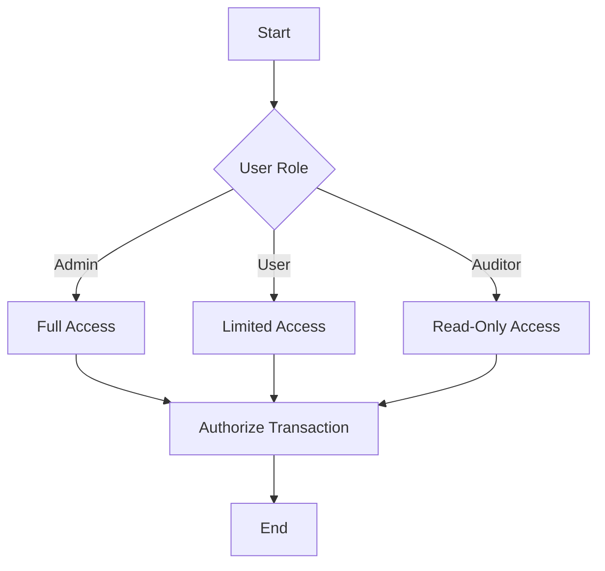
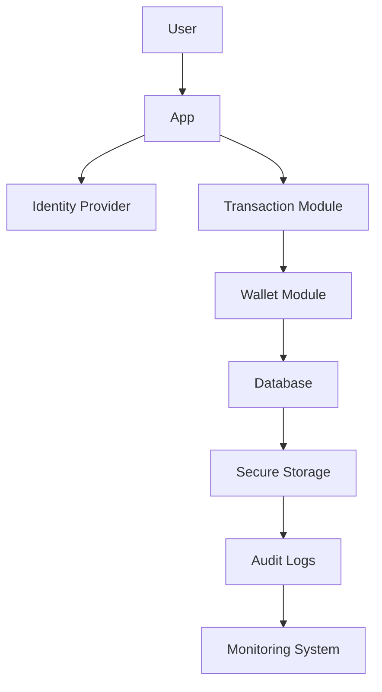
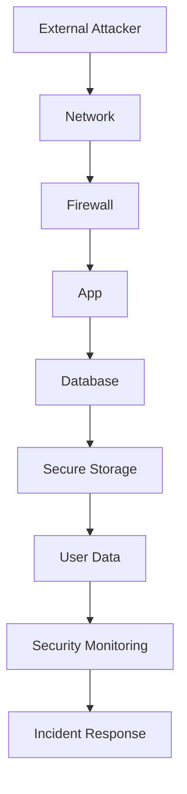

# Security Documentation for Bitcoin Transaction and Wallet Management Framework

## 1. Security Overview

### Security Posture Summary
The Bitcoin Transaction and Wallet Management Framework is designed with a strong security posture to ensure the integrity, confidentiality, and availability of cryptocurrency transactions. The framework incorporates robust cryptographic principles, secure coding practices, and comprehensive access control mechanisms to safeguard user assets and transaction data.

### Compliance Requirements
The framework adheres to industry standards for cryptocurrency security, including compliance with relevant regulations such as GDPR for data protection and PCI DSS for secure transaction processing. It ensures that all cryptographic operations meet the standards set by NIST for secure key management.

### Threat Model Summary
The threat model for this framework identifies potential risks such as unauthorized access, data breaches, and transaction manipulation. Key threats include:
- Compromise of private keys
- Unauthorized transaction execution
- Network-based attacks like DDoS
- Insider threats leading to unauthorized access

Mitigation strategies include multi-factor authentication, encryption, secure key management, and continuous security monitoring.

## 2. Authentication & Identity

### Authentication Mechanisms
The framework employs secure authentication mechanisms, including password-based authentication and public key cryptography for transaction validation.

### Identity Providers
Identity management is handled internally, with the framework generating and managing cryptographic keys for user authentication.

### Session Management
Sessions are managed using secure tokens, ensuring that user sessions are authenticated and authorized before accessing sensitive operations.

### Multi-factor Authentication
Multi-factor authentication is implemented to enhance security, requiring users to verify their identity through additional factors beyond passwords.

### Authentication Flow Diagram

## 3. Authorization & Access Control

### Authorization Model
The framework uses Role-Based Access Control (RBAC) to manage permissions and roles.

### Permission Definitions
Permissions are defined based on the operations users can perform, such as creating transactions, managing wallets, and accessing transaction data.

### Role Definitions
Roles include:
- **Admin**: Full access to all operations
- **User**: Access to personal wallet and transaction management
- **Auditor**: Read-only access for auditing purposes

### Access Control Enforcement Points
Access control is enforced at key points such as transaction creation, wallet management, and data access.

### Authorization Decision Flow

## 4. Data Security

### Data Classification
Data is classified into:
- **Sensitive**: Private keys, transaction details
- **Confidential**: User information, wallet balances
- **Public**: Transaction IDs, public keys

### Encryption at Rest
Sensitive and confidential data is encrypted using AES-256 encryption to protect against unauthorized access.

### Encryption in Transit
Data in transit is secured using TLS to ensure confidentiality and integrity during transmission.

### Key Management
Keys are managed using secure hardware modules and software libraries that comply with industry standards.

### Data Masking/Anonymization
Data masking is applied to sensitive data to protect user privacy, ensuring that only authorized users can view unmasked data.

## 5. API Security

### API Authentication
APIs are authenticated using OAuth tokens to ensure secure access.

### Input Validation
Input validation is performed to prevent injection attacks and ensure data integrity.

### Output Encoding
Output encoding is applied to prevent data leakage and ensure secure data presentation.

### Rate Limiting
Rate limiting is enforced to prevent abuse and ensure fair resource allocation.

### CORS Policy
CORS policy is configured to restrict access to trusted domains only.

## 6. Infrastructure Security

### Network Security
Network security measures include firewalls, intrusion detection systems, and secure VPNs to protect against external threats.

### Container/Runtime Security
Containers are secured using runtime security tools to ensure they operate within defined security boundaries.

### Secrets Management
Secrets are managed using secure vaults and access controls to prevent unauthorized access.

### Security Monitoring
Continuous security monitoring is implemented to detect and respond to threats in real-time.

## 7. Security Operations

### Vulnerability Management
Regular vulnerability assessments and patching are conducted to address security weaknesses.

### Security Logging
Comprehensive logging is implemented to track security events and facilitate auditing.

### Incident Response
An incident response plan is in place to handle security breaches promptly and effectively.

### Security Testing Requirements
Security testing includes penetration testing, code reviews, and automated security scans.

## 8. Compliance

### Regulatory Requirements
The framework complies with GDPR, PCI DSS, and other relevant regulations to ensure data protection and transaction security.

### Audit Requirements
Regular audits are conducted to ensure compliance with security policies and standards.

### Security Certifications
The framework aims to achieve certifications such as ISO 27001 to demonstrate its commitment to security.

## Mermaid Diagram Requirements

### Data Flow with Security Boundaries

### Threat Model Diagram

This documentation provides a comprehensive overview of the security measures implemented in the Bitcoin Transaction and Wallet Management Framework, ensuring robust protection against potential threats and compliance with industry standards.