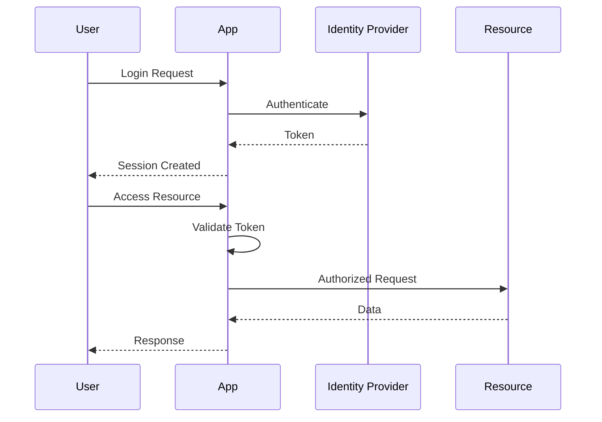
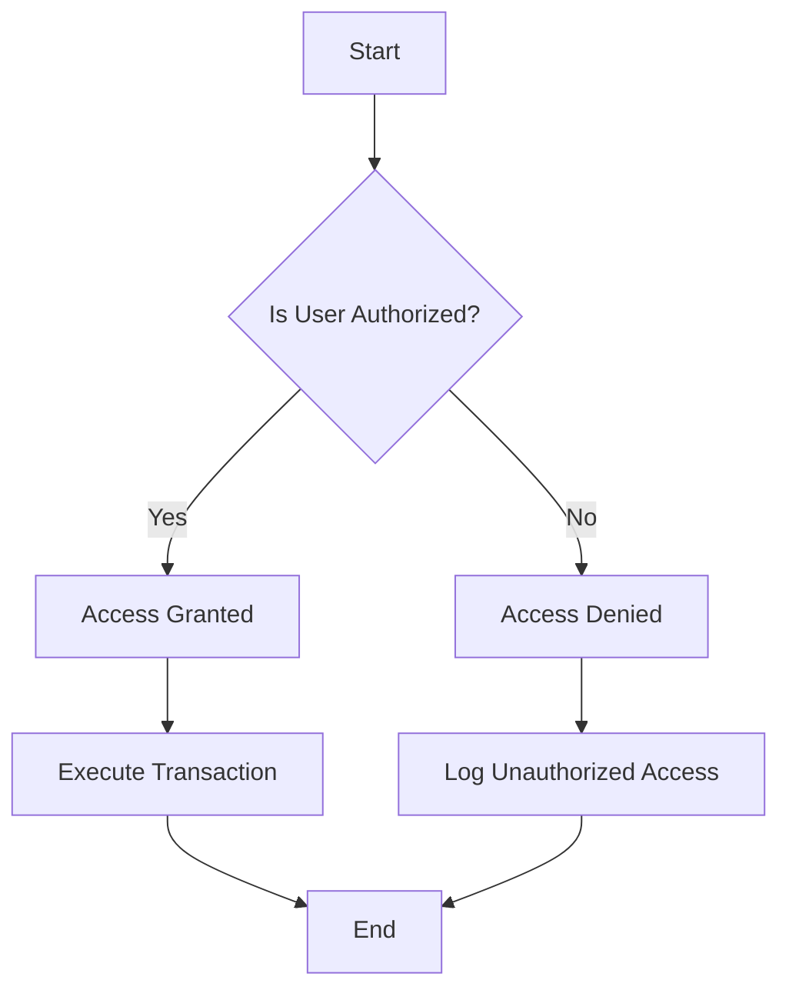
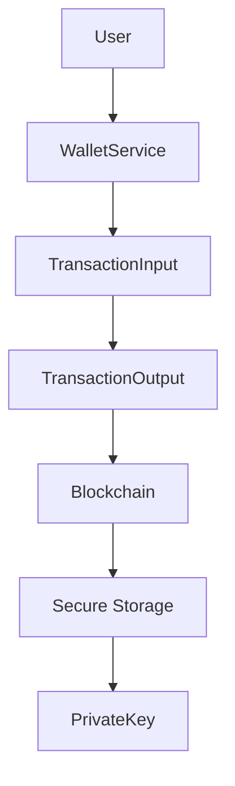

# Security Documentation for Bitcoin Transaction and Wallet Management Codebase

## 1. Security Overview

### Security Posture Summary
The codebase for Bitcoin transaction and wallet management is designed with a focus on cryptographic security, data integrity, and transaction validation. It employs secure random number generation for key management and encapsulates transaction inputs and outputs to ensure proper validation and execution. The modular design supports robust security practices, allowing for efficient management of wallets and transactions.

### Compliance Requirements
[Requires additional context]

### Threat Model Summary
The primary threats to the codebase include unauthorized access to private keys, transaction manipulation, and wallet compromise. The system mitigates these risks through secure key generation, transaction validation, and encapsulation of transaction components. Additional security measures such as multi-factor authentication and role-based access control are recommended to enhance security.

## 2. Authentication & Identity

### Authentication Mechanisms
- Secure random generation for private key creation
- Validation of Bitcoin addresses upon initialization

### Identity Providers
[Requires additional context]

### Session Management
[Requires additional context]

### Multi-factor Authentication
[Requires additional context]

### Authentication Flow Diagram

## 3. Authorization & Access Control

### Authorization Model
- Role-Based Access Control (RBAC) is recommended for managing permissions related to wallet operations and transaction processing.

### Permission Definitions
- Permissions for creating wallets, sending funds, and receiving funds.

### Role Definitions
- Wallet Manager: Manages wallet creation and fund transactions.
- Transaction Validator: Validates transaction inputs and outputs.

### Access Control Enforcement Points
- WalletService class methods for fund transactions
- FeeEstimator module for transaction fee calculations

### Authorization Decision Flow

## 4. Data Security

### Data Classification
- Transaction data: Sensitive
- Wallet data: Sensitive
- Key data: Highly Sensitive

### Encryption at Rest
- Private keys stored securely with encryption

### Encryption in Transit
- Transactions and wallet operations should be encrypted using TLS

### Key Management
- SecureRandom instance used for generating cryptographically secure keys

### Data Masking/Anonymization
- Masking of sensitive data in logs and outputs

## 5. API Security

### API Authentication
- Secure authentication mechanisms for API access

### Input Validation
- Validation of Bitcoin addresses and transaction inputs

### Output Encoding
- Proper encoding of transaction outputs to prevent injection attacks

### Rate Limiting
[Requires additional context]

### CORS Policy
[Requires additional context]

## 6. Infrastructure Security

### Network Security
- Use of firewalls and secure network configurations

### Container/Runtime Security
[Requires additional context]

### Secrets Management
- Secure storage and access controls for private keys

### Security Monitoring
- Monitoring for unauthorized access and transaction anomalies

## 7. Security Operations

### Vulnerability Management
- Regular security audits and code reviews

### Security Logging
- Logging of transaction activities and access attempts

### Incident Response
- Procedures for responding to security breaches

### Security Testing Requirements
- Regular penetration testing and vulnerability assessments

## 8. Compliance

### Regulatory Requirements
[Requires additional context]

### Audit Requirements
- Regular audits of transaction processes and key management

### Security Certifications
[Requires additional context]

## Mermaid Diagram Requirements

### Data Flow with Security Boundaries

### Threat Model Diagram
[Requires additional context]

This documentation provides a comprehensive overview of the security measures and practices recommended for the Bitcoin transaction and wallet management codebase. Additional context is required for certain sections to ensure full compliance and security coverage.