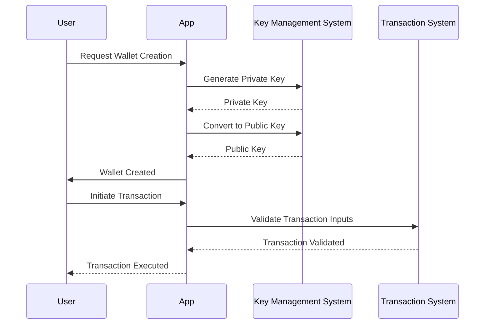
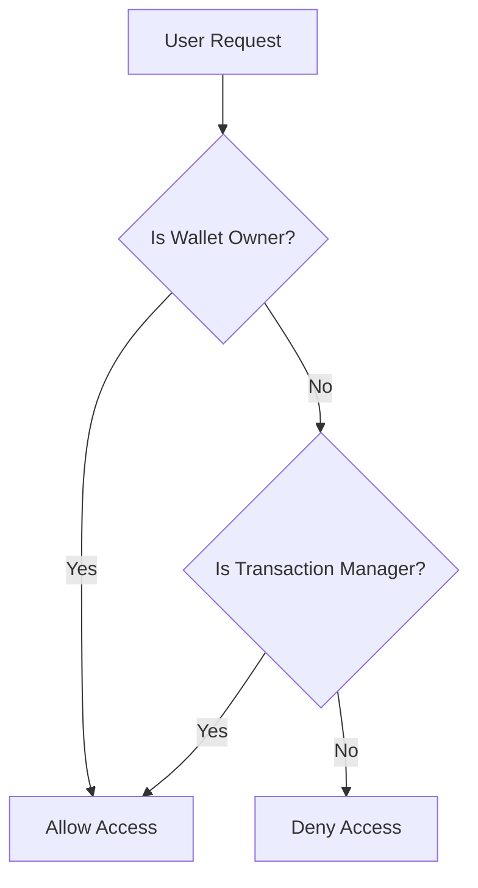

# Security Documentation for Cryptocurrency and Blockchain Technology Codebase

## 1. Security Overview

### Security Posture Summary
This codebase is designed to manage Bitcoin transactions and wallets, emphasizing security through cryptographic key management, transaction validation, and secure wallet operations. The architecture leverages modular design and data encapsulation to ensure robust security measures are in place, protecting user assets and transaction integrity.

### Compliance Requirements
[Requires additional context]

### Threat Model Summary
The primary threats include unauthorized access to wallets, transaction manipulation, and exposure of private keys. The codebase addresses these threats through secure key generation, transaction validation, and wallet management practices.

## 2. Authentication & Identity

### Authentication Mechanisms
- Secure generation of private keys using `SecureRandom`.
- Conversion of private keys to public keys for transaction authorization.

### Identity Providers
[Requires additional context]

### Session Management
[Requires additional context]

### Multi-factor Authentication
[Requires additional context]

### Authentication Flow Diagram


## 3. Authorization & Access Control

### Authorization Model
- Role-Based Access Control (RBAC) for wallet operations.

### Permission Definitions
- Create Wallet
- Send Funds
- Receive Funds
- Access Transaction History

### Role Definitions
- Wallet Owner
- Transaction Manager

### Access Control Enforcement Points
- WalletService methods: `createWallet`, `sendFunds`, `receiveFunds`.

### Authorization Decision Flow


## 4. Data Security

### Data Classification
- Sensitive: Private keys, transaction inputs/outputs.
- Non-sensitive: Public keys, wallet addresses.

### Encryption at Rest
[Requires additional context]

### Encryption in Transit
[Requires additional context]

### Key Management
- SecureRandom for private key generation.
- PrivateKey class for key operations.

### Data Masking/Anonymization
[Requires additional context]

## 5. API Security

### API Authentication
[Requires additional context]

### Input Validation
- Validation of Bitcoin addresses in `Address` class.
- Validation of transaction inputs in `TransactionInput` class.

### Output Encoding
[Requires additional context]

### Rate Limiting
[Requires additional context]

### CORS Policy
[Requires additional context]

## 6. Infrastructure Security

### Network Security
[Requires additional context]

### Container/Runtime Security
[Requires additional context]

### Secrets Management
- Secure storage and handling of private keys.

### Security Monitoring
[Requires additional context]

## 7. Security Operations

### Vulnerability Management
- Regular updates and audits of cryptographic methods.
- Monitoring for known vulnerabilities in Bitcoin transaction handling.

### Security Logging
[Requires additional context]

### Incident Response
[Requires additional context]

### Security Testing Requirements
- Unit tests for key generation and transaction validation.
- Integration tests for wallet operations.

## 8. Compliance

### Regulatory Requirements
[Requires additional context]

### Audit Requirements
[Requires additional context]

### Security Certifications
[Requires additional context]

## Mermaid Diagram Requirements

### Data Flow with Security Boundaries
```mermaid
flowchart TD
    U[User] --> W[Wallet Service]
    W --> K[Key Management]
    K --> T[Transaction System]
    T --> B[Blockchain]
    classDef boundary fill:#f9f,stroke:#333,stroke-width:2px;
    W,K,T,B boundary
```

### Threat Model Diagram
[Requires additional context]

This documentation provides a comprehensive overview of the security measures implemented in the cryptocurrency and blockchain technology codebase, focusing on key management, transaction validation, and wallet operations. Additional context is required for sections related to compliance, infrastructure security, and API security.