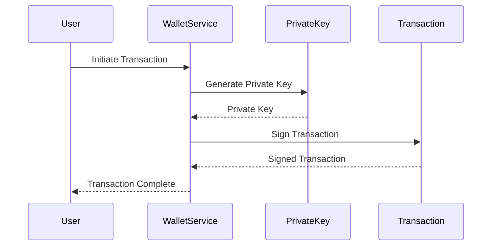
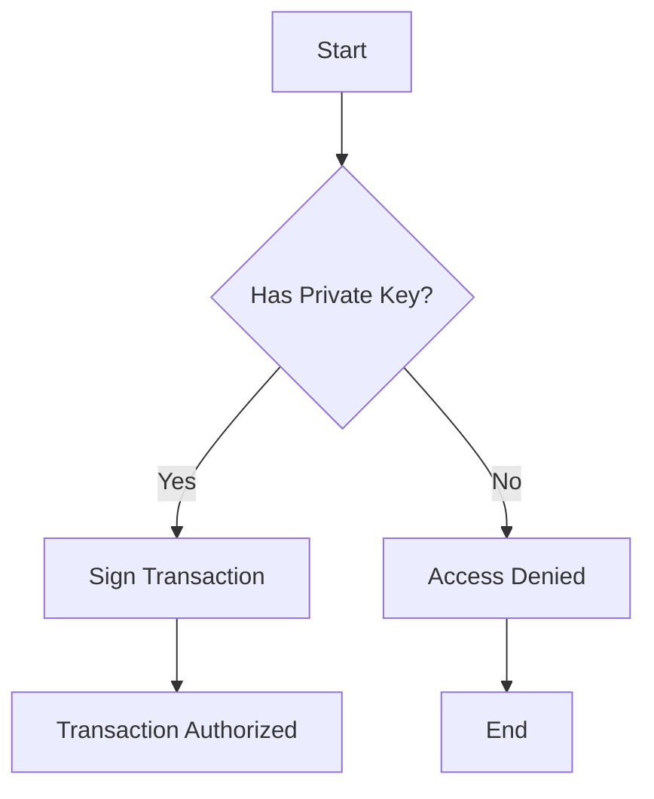
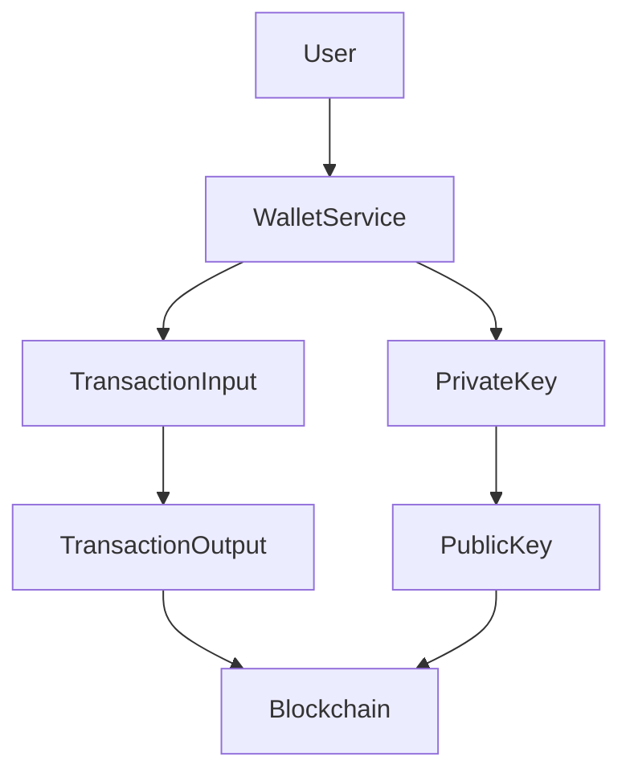

# Security Documentation for Bitcoin Transaction and Wallet Management Framework

## 1. Security Overview

### Security Posture Summary
The Bitcoin Transaction and Wallet Management Framework is designed with robust security measures to ensure the integrity and confidentiality of Bitcoin transactions and wallet operations. The framework employs cryptographic principles to safeguard private keys, transaction inputs, and outputs, while ensuring secure wallet management and fee estimation.

### Compliance Requirements
[Requires additional context]

### Threat Model Summary
The framework addresses key threats such as unauthorized access to private keys, transaction manipulation, and wallet compromise. It leverages cryptographic techniques to mitigate these risks, ensuring secure transaction processing and wallet management.

## 2. Authentication & Identity

### Authentication Mechanisms
The framework utilizes cryptographic keys for authentication, where private keys are used to sign transactions and public keys are used for verification.

### Identity Providers
[Requires additional context]

### Session Management
Session management is primarily handled through secure key storage and transaction signing mechanisms.

### Multi-factor Authentication
[Requires additional context]

### Authentication Flow Diagram

## 3. Authorization & Access Control

### Authorization Model
The framework employs Attribute-Based Access Control (ABAC) to manage permissions based on cryptographic attributes.

### Permission Definitions
Permissions are defined based on the ability to sign transactions and manage wallet operations.

### Role Definitions
Roles are implicitly defined through key ownership and wallet management capabilities.

### Access Control Enforcement Points
Access control is enforced at transaction signing and wallet operation points.

### Authorization Decision Flow

## 4. Data Security

### Data Classification
Data is classified into transaction data, wallet data, and cryptographic key data.

### Encryption at Rest
Private keys are encrypted at rest using secure cryptographic algorithms.

### Encryption in Transit
Transaction data is encrypted in transit using secure protocols.

### Key Management
SecureRandom is used for generating cryptographically secure private keys.

### Data Masking/Anonymization
[Requires additional context]

## 5. API Security

### API Authentication
API authentication is managed through cryptographic key verification.

### Input Validation
Input validation is performed on transaction inputs and outputs to ensure data integrity.

### Output Encoding
Output encoding is applied to transaction data to prevent data leakage.

### Rate Limiting
[Requires additional context]

### CORS Policy
[Requires additional context]

## 6. Infrastructure Security

### Network Security
[Requires additional context]

### Container/Runtime Security
[Requires additional context]

### Secrets Management
Secrets such as private keys are securely managed using encryption.

### Security Monitoring
[Requires additional context]

## 7. Security Operations

### Vulnerability Management
[Requires additional context]

### Security Logging
Security logging is implemented for transaction and wallet operations.

### Incident Response
[Requires additional context]

### Security Testing Requirements
Regular security testing is required for cryptographic operations and transaction processing.

## 8. Compliance

### Regulatory Requirements
[Requires additional context]

### Audit Requirements
[Requires additional context]

### Security Certifications
[Requires additional context]

## Mermaid Diagram Requirements

### Data Flow with Security Boundaries

### Threat Model Diagram
[Requires additional context]

This documentation provides a comprehensive overview of the security measures implemented in the Bitcoin Transaction and Wallet Management Framework. It emphasizes cryptographic security, access control, and data integrity, ensuring secure and efficient transaction processing within the Bitcoin ecosystem.