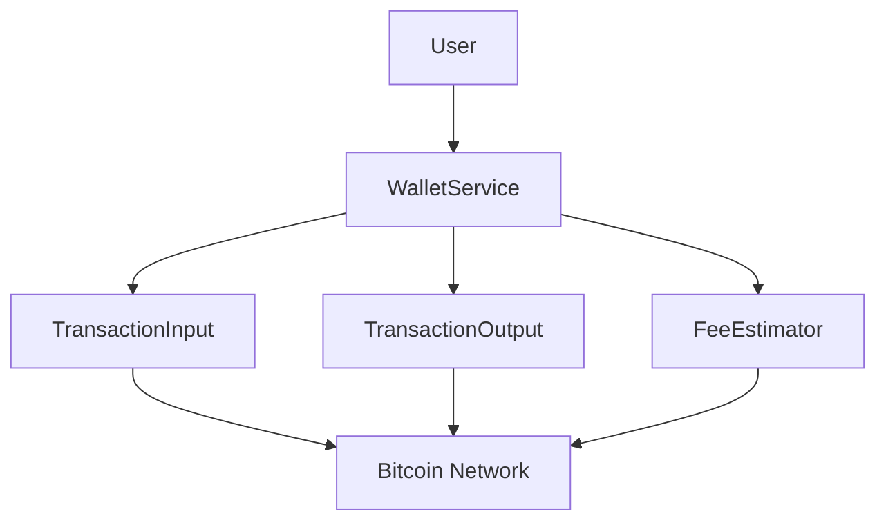
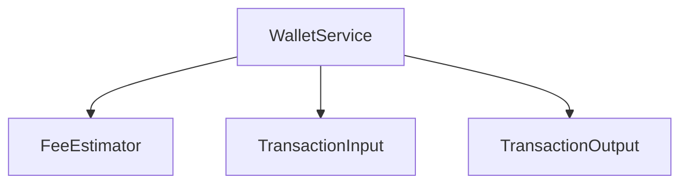
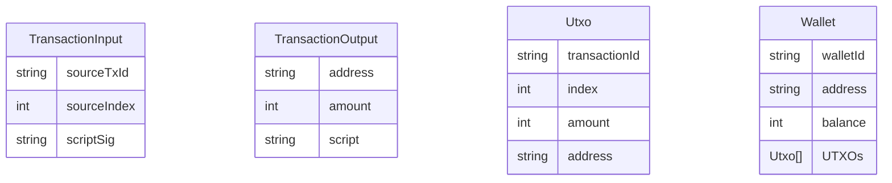

# Technical Specification Document

## 1. Executive Summary

The system is designed to facilitate secure and efficient management of Bitcoin transactions and wallets within the cryptocurrency and blockchain technology domain. It provides essential functionalities for handling transaction inputs, outputs, fee estimation, and cryptographic key management, contributing significant business value by enabling secure and reliable Bitcoin operations.

### Key Capabilities:
- Representation and processing of Bitcoin transactions
- Management of Bitcoin wallets and UTXOs
- Estimation of transaction fees
- Cryptographic key generation and conversion
- Validation and execution of Bitcoin transactions

### Technology Stack Overview:
- Language: Kotlin
- Cryptographic Library: SecureRandom
- Blockchain Domain: Bitcoin

## 2. System Overview

The system is structured into several core components, each responsible for specific functionalities within the Bitcoin transaction lifecycle. These components interact to provide a cohesive framework for managing transactions and wallets securely.

### Core Components:
- **TransactionInput**: Manages transaction inputs, including source transaction ID and script signature.
- **TransactionOutput**: Represents transaction outputs, associating addresses with amounts.
- **Utxo**: Tracks unspent transaction outputs.
- **FeeEstimator**: Estimates transaction fees based on network conditions.
- **Wallet**: Manages Bitcoin wallets, including UTXOs and balance.
- **WalletService**: Facilitates wallet operations such as creation, fund reception, and fund sending.
- **PrivateKey**: Generates and converts private keys to public keys.
- **PublicKey**: Represents public keys.

### System Boundaries and Interfaces:
- Interfaces with external Bitcoin network for transaction validation and execution.
- Provides API endpoints for wallet management and transaction processing.

## 3. Functional Specifications

### Feature: Wallet Creation (ID: WC001)
- **Business Requirement**: Enable users to create new Bitcoin wallets.
- **Functional Behavior**: Generates a unique wallet ID, initializes with zero balance.
- **Input/Output Specifications**: Inputs: User ID, Outputs: Wallet ID, Address
- **Business Rules and Validation**: Ensure unique wallet ID and valid Bitcoin address.
- **Error Handling Behavior**: Return error if wallet creation fails.
- **Example Usage Scenario**: User requests to create a wallet, system generates and returns wallet details.

### Feature: Fee Estimation (ID: FE001)
- **Business Requirement**: Provide accurate transaction fee estimation.
- **Functional Behavior**: Calculates fees based on satoshis per vbyte.
- **Input/Output Specifications**: Inputs: Transaction size, Outputs: Estimated fee
- **Business Rules and Validation**: Validate transaction size and fee rate.
- **Error Handling Behavior**: Return error if estimation fails.
- **Example Usage Scenario**: User requests fee estimation, system calculates and returns fee.

### Feature: Transaction Processing (ID: TP001)
- **Business Requirement**: Process Bitcoin transactions securely.
- **Functional Behavior**: Validates and executes transactions using inputs and outputs.
- **Input/Output Specifications**: Inputs: Transaction details, Outputs: Transaction status
- **Business Rules and Validation**: Ensure valid inputs and sufficient balance.
- **Error Handling Behavior**: Return error if transaction fails.
- **Example Usage Scenario**: User initiates transaction, system processes and confirms execution.

## 4. Technical Requirements

- **Performance Requirements**: 
  - Latency: < 100ms for wallet operations
  - Throughput: 100 transactions per second
  - Concurrency: Support for 1000 concurrent users

- **Scalability Requirements**: 
  - Horizontal scalability for transaction processing
  - Support for additional wallet services

- **Availability Requirements**: 
  - 99.99% uptime for wallet services
  - Redundant systems for transaction processing

- **Data Retention Requirements**: 
  - Retain transaction logs for 1 year
  - Secure storage for cryptographic keys

## 5. Component Specifications

### Component: TransactionInput
- **Purpose**: Manage transaction inputs.
- **Responsibilities**: Encapsulate source transaction ID and script signature.
- **Dependencies**: Requires access to Bitcoin network for validation.
- **Interfaces**: Exposes methods for input validation and retrieval.
- **Internal Design Notes**: Utilizes data class pattern for encapsulation.
- **Configuration Options**: None

### Component: WalletService
- **Purpose**: Manage wallet operations.
- **Responsibilities**: Create wallets, receive and send funds.
- **Dependencies**: Depends on FeeEstimator for fee calculations.
- **Interfaces**: Exposes API endpoints for wallet management.
- **Internal Design Notes**: Implements service-oriented architecture.
- **Configuration Options**: Configurable fee rate

## 6. Data Specifications

### Data Entities and Attributes:
- **TransactionInput**: sourceTxId, sourceIndex, scriptSig
- **TransactionOutput**: address, amount, script
- **Utxo**: transactionId, index, amount, address
- **Wallet**: walletId, address, balance, UTXOs

### Data Validation Rules:
- Ensure valid Bitcoin address format.
- Validate transaction ID and index.
- Check sufficient balance for transactions.

### Data Transformation Logic:
- Convert private keys to public keys.
- Calculate transaction fees from inputs.

## 7. Integration Specifications

### External System Integrations:
- Bitcoin network for transaction validation and execution.

### API Contracts:
- Wallet creation: POST /wallets
- Fee estimation: GET /fees
- Transaction processing: POST /transactions

### Message Formats:
- JSON for API requests and responses.

### Authentication/Authorization Mechanisms:
- OAuth2 for API access.
- Role-based access control for wallet operations.

## 8. Error Handling Specifications

### Error Categories:
- Validation errors
- Processing errors
- Network errors

### Error Codes and Meanings:
- 400: Bad Request
- 401: Unauthorized
- 500: Internal Server Error

### Recovery Procedures:
- Retry mechanism for network errors.
- User notification for validation errors.

### Logging and Monitoring Requirements:
- Log all transaction attempts and errors.
- Monitor API endpoint usage and performance.

## 9. Security Specifications

### Authentication Mechanisms:
- OAuth2 for secure API access.

### Authorization Model:
- Role-based access control for wallet operations.

### Data Protection Measures:
- Secure storage for cryptographic keys.
- Encryption of sensitive data in transit and at rest.

### Security-Sensitive Operations:
- Key generation and conversion.
- Transaction processing and validation.

## 10. Appendices

### Glossary of Terms:
- **UTXO**: Unspent Transaction Output
- **Satoshis**: Smallest unit of Bitcoin

### Reference Documents:
- Bitcoin Whitepaper
- OAuth2 Specification

### Version History:
- v1.0: Initial release
- v1.1: Added fee estimation feature

---

This document provides a comprehensive overview of the system, detailing its architecture, components, and functionalities. It serves as a guide for developers, architects, security teams, and operations personnel to understand and manage the Bitcoin transaction and wallet management system effectively.