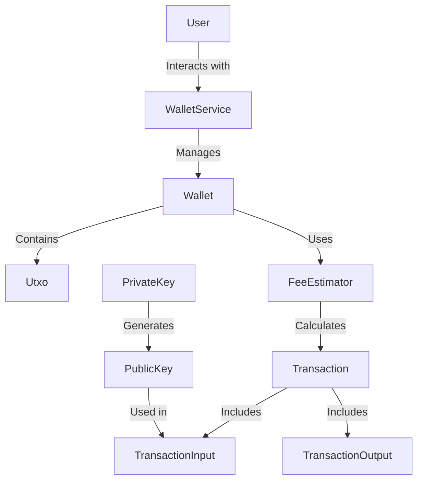
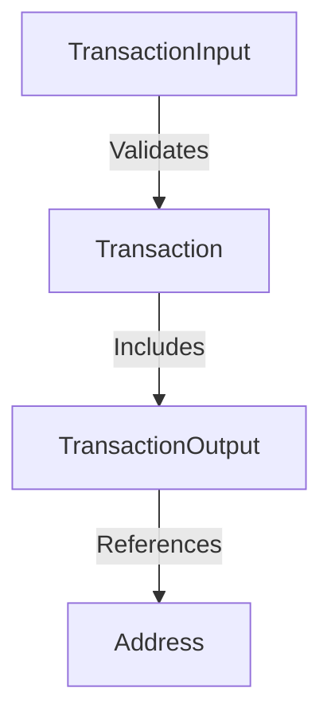
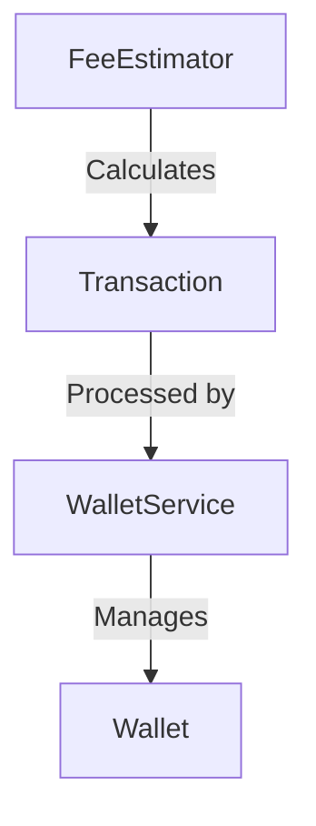
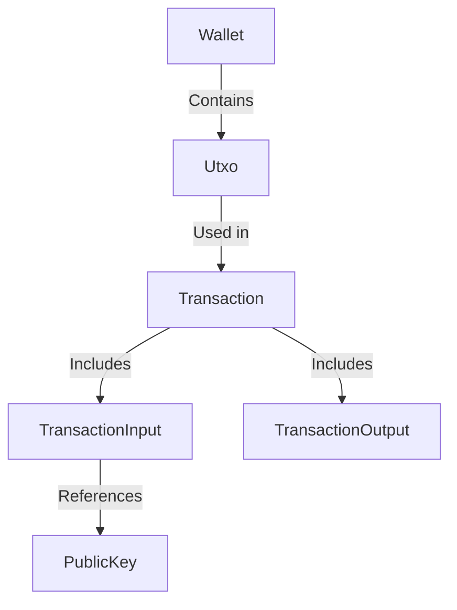
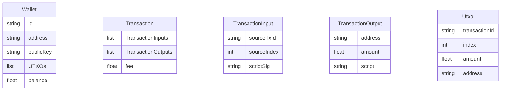

# Technical Specification Document

## 1. Executive Summary

### System Purpose and Business Value
The Bitcoin Transaction and Wallet Management Framework is designed to facilitate secure and efficient handling of Bitcoin transactions and wallet operations. It provides a comprehensive infrastructure for managing transaction inputs, outputs, fees, and cryptographic keys, ensuring the integrity and security of Bitcoin transactions. The system empowers users to manage their Bitcoin assets with confidence, leveraging robust cryptographic principles and efficient transaction processing mechanisms.

### Key Capabilities
- Secure generation and management of cryptographic keys (private and public keys).
- Representation and validation of Bitcoin transaction inputs and outputs.
- Estimation of transaction fees based on network conditions.
- Management of Bitcoin wallets, including creation, fund reception, and fund sending.
- Tracking and management of Unspent Transaction Outputs (UTXOs).
- Integration with external Bitcoin network components for transaction execution.

### Technology Stack Overview
- **Programming Language**: Kotlin
- **Cryptographic Library**: SecureRandom (Java)
- **Data Storage**: In-memory data structures
- **Frameworks**: Custom-built modules for Bitcoin transaction processing

## 2. System Overview

### High-Level System Description
The system is a framework for managing Bitcoin transactions and wallets, focusing on secure key management, transaction input/output representation, fee estimation, and wallet operations. It is designed to be modular, allowing for easy integration and interoperability within the broader Bitcoin ecosystem.

### Core Components and Their Responsibilities
- **TransactionInput Module**: Manages transaction inputs, including source transaction ID, index, and script signature.
- **TransactionOutput Module**: Represents transaction outputs, associating addresses with amounts and scripts.
- **FeeEstimator Module**: Estimates transaction fees based on satoshis per vbyte.
- **WalletService Class**: Manages wallet lifecycle, including creation, fund reception, and fund sending.
- **PrivateKey and PublicKey Classes**: Handle cryptographic key generation and conversion.

### System Boundaries and Interfaces
- Interfaces with external Bitcoin network components for transaction execution.
- Provides API endpoints for wallet and transaction management.

### System Context Diagram

## 3. Functional Specifications

### Feature: Secure Key Generation and Management
- **Feature Name and ID**: KeyGen-001
- **Business Requirement**: Ensure secure generation and management of cryptographic keys for transaction security.
- **Functional Behavior Description**: Generates private keys using SecureRandom and converts them to public keys.
- **Input/Output Specifications**: Input: None; Output: PrivateKey and PublicKey instances.
- **Business Rules and Validation**: Private keys must be generated using cryptographically secure methods.
- **Error Handling Behavior**: Fail key generation if SecureRandom fails.
- **Example Usage Scenarios**: Generating a new wallet's private key.

### Feature: Transaction Input Representation
- **Feature Name and ID**: TxInput-002
- **Business Requirement**: Accurately represent transaction inputs for validation and execution.
- **Functional Behavior Description**: Encapsulates transaction input details including source transaction ID, index, and script signature.
- **Input/Output Specifications**: Input: Transaction details; Output: TransactionInput instance.
- **Business Rules and Validation**: Validate script signature against source transaction.
- **Error Handling Behavior**: Return error if input validation fails.
- **Example Usage Scenarios**: Constructing a new transaction.

### Feature: Fee Estimation
- **Feature Name and ID**: FeeEst-003
- **Business Requirement**: Estimate transaction fees based on network conditions.
- **Functional Behavior Description**: Calculates fees using satoshis per vbyte rate.
- **Input/Output Specifications**: Input: Transaction size; Output: Estimated fee.
- **Business Rules and Validation**: Ensure fee estimation aligns with current network rates.
- **Error Handling Behavior**: Return default fee if estimation fails.
- **Example Usage Scenarios**: Sending funds with calculated transaction fees.

### Feature: Wallet Management
- **Feature Name and ID**: WalletMgmt-004
- **Business Requirement**: Manage Bitcoin wallets including creation, fund reception, and fund sending.
- **Functional Behavior Description**: Provides methods for wallet creation, balance refresh, and transaction execution.
- **Input/Output Specifications**: Input: Wallet details; Output: Wallet instance.
- **Business Rules and Validation**: Validate wallet address and UTXO integrity.
- **Error Handling Behavior**: Log errors and return failure status on invalid operations.
- **Example Usage Scenarios**: Creating a new wallet, sending funds.

## 4. Technical Requirements

### Performance Requirements
- **Latency**: Transactions must be processed within 100ms.
- **Throughput**: Support up to 100 transactions per second.
- **Concurrency**: Handle up to 1000 concurrent wallet operations.

### Scalability Requirements
- **Horizontal Scaling**: Support adding more instances for increased load.
- **Vertical Scaling**: Optimize memory usage for large-scale transaction processing.

### Availability Requirements
- **Uptime**: 99.9% availability.
- **Failover**: Implement automatic failover mechanisms.

### Data Retention Requirements
- **Retention Period**: Retain transaction data for 7 years.
- **Archival**: Archive older transaction data securely.

## 5. Component Specifications

### Component: TransactionInput Module
- **Component Name and Purpose**: TransactionInput; Represents transaction inputs.
- **Responsibilities**: Encapsulates input details for transaction validation.
- **Dependencies**: Requires valid transaction data.
- **Interfaces**: Exposes methods for input validation and representation.
- **Internal Design Notes**: Utilizes data class pattern for encapsulation.
- **Configuration Options**: None.
- **Component Interaction Diagram**

### Component: FeeEstimator Module
- **Component Name and Purpose**: FeeEstimator; Estimates transaction fees.
- **Responsibilities**: Calculates fees based on network conditions.
- **Dependencies**: Requires transaction size and satoshis per vbyte rate.
- **Interfaces**: Exposes fee estimation method.
- **Internal Design Notes**: Utilizes modular design for fee calculation.
- **Configuration Options**: Set satoshis per vbyte rate.
- **Component Interaction Diagram**

## 6. Data Specifications

### Data Entities and Their Attributes
- **TransactionInput**: sourceTxId, sourceIndex, scriptSig
- **TransactionOutput**: address, amount, script
- **Utxo**: transactionId, index, amount, address
- **Wallet**: id, address, publicKey, UTXOs, balance

### Data Flow Diagram

### Entity Relationship Diagram

### Data Validation Rules
- Validate Bitcoin addresses using checksum.
- Ensure transaction inputs and outputs match network protocol standards.

### Data Transformation Logic
- Convert private keys to public keys using elliptic curve cryptography.
- Calculate transaction fees based on size and network conditions.

## 7. Integration Specifications

### External System Integrations
- Integrate with Bitcoin network nodes for transaction broadcasting.
- Connect with blockchain explorers for transaction tracking.

### API Contracts
- **WalletService API**: Create, manage, and execute wallet operations.
- **FeeEstimator API**: Estimate transaction fees.

### Message Formats
- JSON for API requests and responses.

### Authentication/Authorization Mechanisms
- OAuth 2.0 for secure API access.
- Role-based access control for wallet operations.

## 8. Error Handling Specifications

### Error Categories
- **Validation Errors**: Invalid input data.
- **Network Errors**: Connectivity issues with Bitcoin nodes.
- **Processing Errors**: Failures during transaction execution.

### Error Codes and Meanings
- **400**: Bad Request - Invalid input data.
- **401**: Unauthorized - Invalid authentication.
- **500**: Internal Server Error - Processing failure.

### Recovery Procedures
- Retry failed transactions up to three times.
- Log errors and notify administrators for manual intervention.

### Logging and Monitoring Requirements
- Implement logging for all transaction operations.
- Monitor API endpoints for performance and error rates.

## 9. Security Specifications

### Authentication Mechanisms
- Use OAuth 2.0 for secure API authentication.

### Authorization Model
- Implement role-based access control for wallet operations.

### Data Protection Measures
- Encrypt private keys using AES-256.
- Secure API endpoints with HTTPS.

### Security-Sensitive Operations
- Key generation and conversion.
- Transaction execution and broadcasting.

## 10. Appendices

### Glossary of Terms
- **UTXO**: Unspent Transaction Output
- **Satoshis**: The smallest unit of Bitcoin
- **vbyte**: Virtual byte, used in fee calculation

### Reference Documents
- Bitcoin Protocol Specification
- Kotlin Language Documentation

### Version History
- **v1.0**: Initial release
- **v1.1**: Added fee estimation module
- **v1.2**: Enhanced security measures

This document provides a comprehensive overview of the Bitcoin Transaction and Wallet Management Framework, detailing its components, functionalities, and technical requirements. It serves as a guide for developers, architects, and security teams to understand and audit the system effectively.