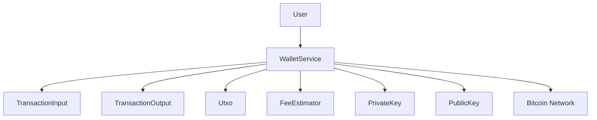
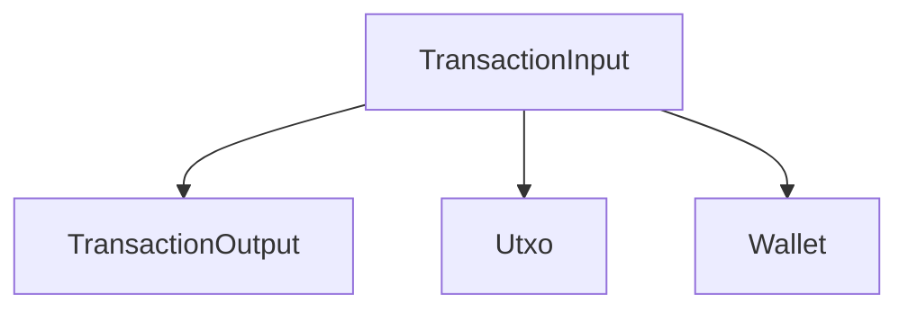
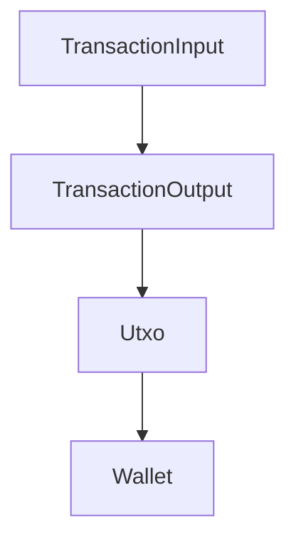
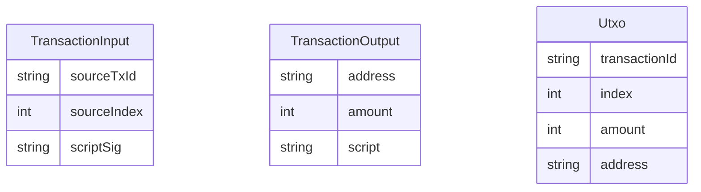

# Technical Specification Document

## 1. Executive Summary

### System Purpose and Business Value
The Bitcoin Transaction and Wallet Management System is designed to facilitate secure and efficient handling of Bitcoin transactions and wallet operations. It provides a robust framework for managing transaction inputs, outputs, and cryptographic keys, ensuring the integrity and security of Bitcoin transactions. The system supports the broader cryptocurrency ecosystem by enabling seamless transaction processing and wallet management.

### Key Capabilities
- Representation and validation of Bitcoin transaction inputs and outputs
- Secure generation and management of cryptographic keys (private and public)
- Estimation and calculation of transaction fees
- Management of Bitcoin wallets, including creation, fund reception, and fund sending
- Tracking and management of Unspent Transaction Outputs (UTXOs)

### Technology Stack Overview
- **Language**: Kotlin
- **Cryptography**: SecureRandom for key generation
- **Data Management**: Data classes for encapsulation and modular design
- **Design Patterns**: Modular design, data encapsulation, separation of concerns

## 2. System Overview

### High-Level System Description
The system is a comprehensive framework for managing Bitcoin transactions and wallets. It includes modules for transaction input and output representation, cryptographic key management, fee estimation, and wallet operations. The system is designed to ensure secure and efficient transaction processing within the Bitcoin network.

### Core Components and Their Responsibilities
- **TransactionInput Module**: Represents and validates transaction inputs.
- **TransactionOutput Module**: Represents transaction outputs.
- **Utxo Module**: Manages unspent transaction outputs.
- **FeeEstimator Module**: Estimates transaction fees.
- **PrivateKey and PublicKey Modules**: Manage cryptographic keys.
- **Wallet Module**: Manages wallet operations and UTXOs.
- **WalletService Module**: Oversees wallet lifecycle and transactions.

### System Boundaries and Interfaces
- Interfaces with external Bitcoin network for transaction validation and execution.
- Provides API for wallet management and transaction processing.

### System Context Diagram

## 3. Functional Specifications

### Feature: Transaction Input Representation
- **Feature Name and ID**: Transaction Input Representation - F001
- **Business Requirement**: Accurately represent and validate transaction inputs for Bitcoin transactions.
- **Functional Behavior Description**: Encapsulates transaction input details including source transaction ID, source index, and script signature.
- **Input/Output Specifications**: Inputs include transaction ID, index, and script signature. Outputs are validated transaction inputs.
- **Business Rules and Validation**: Ensure inputs are correctly formatted and valid within the Bitcoin network.
- **Error Handling Behavior**: Invalid inputs result in error messages and transaction rejection.
- **Example Usage Scenarios**: Validating a transaction input before processing a Bitcoin transaction.

### Feature: Fee Estimation
- **Feature Name and ID**: Fee Estimation - F002
- **Business Requirement**: Calculate transaction fees based on network conditions.
- **Functional Behavior Description**: Estimates fees using satoshis per vbyte rate.
- **Input/Output Specifications**: Inputs include transaction size and satoshis per vbyte. Outputs are estimated fees.
- **Business Rules and Validation**: Fee estimation must reflect current network conditions.
- **Error Handling Behavior**: Invalid inputs result in error messages.
- **Example Usage Scenarios**: Estimating fees before sending a Bitcoin transaction.

### Feature: Wallet Management
- **Feature Name and ID**: Wallet Management - F003
- **Business Requirement**: Manage Bitcoin wallets including creation, fund reception, and fund sending.
- **Functional Behavior Description**: Handles wallet lifecycle and transactions.
- **Input/Output Specifications**: Inputs include wallet details and transaction requests. Outputs are updated wallet states.
- **Business Rules and Validation**: Ensure wallets are valid and transactions are authorized.
- **Error Handling Behavior**: Invalid wallet operations result in error messages.
- **Example Usage Scenarios**: Creating a new wallet and sending funds.

## 4. Technical Requirements

### Performance Requirements
- **Latency**: Transaction processing should occur within 500ms.
- **Throughput**: Support up to 1000 transactions per second.
- **Concurrency**: Handle concurrent wallet operations without data corruption.

### Scalability Requirements
- System must scale horizontally to accommodate increasing transaction volumes.

### Availability Requirements
- Achieve 99.99% uptime for wallet and transaction services.

### Data Retention Requirements
- Retain transaction data for a minimum of 7 years for audit purposes.

## 5. Component Specifications

### Component: TransactionInput
- **Component Name and Purpose**: TransactionInput - Represents transaction inputs.
- **Responsibilities**: Encapsulates transaction input details.
- **Dependencies**: Requires valid transaction IDs and script signatures.
- **Interfaces**: Exposes methods for input validation.
- **Internal Design Notes**: Utilizes data class pattern for encapsulation.
- **Configuration Options**: [Requires additional context]

### Component Interaction Diagram

## 6. Data Specifications

### Data Entities and Their Attributes
- **TransactionInput**: sourceTxId, sourceIndex, scriptSig
- **TransactionOutput**: address, amount, script
- **Utxo**: transactionId, index, amount, address

### Data Flow Diagram

### Entity Relationship Diagram

### Data Validation Rules
- Ensure all transaction IDs are valid and exist within the Bitcoin network.
- Validate script signatures for authenticity.

### Data Transformation Logic
- Convert transaction inputs to outputs during transaction processing.

## 7. Integration Specifications

### External System Integrations
- Integrate with Bitcoin network for transaction validation.

### API Contracts
- Provide RESTful API for wallet operations.

### Message Formats
- JSON format for API requests and responses.

### Authentication/Authorization Mechanisms
- OAuth 2.0 for API access control.

## 8. Error Handling Specifications

### Error Categories
- Validation Errors
- Network Errors
- Transaction Processing Errors

### Error Codes and Meanings
- 400: Bad Request - Invalid input data
- 401: Unauthorized - Invalid authentication
- 500: Internal Server Error - Unexpected server issue

### Recovery Procedures
- Retry failed transactions with exponential backoff.

### Logging and Monitoring Requirements
- Log all transaction attempts and errors.
- Monitor system performance and error rates.

## 9. Security Specifications

### Authentication Mechanisms
- SecureRandom for key generation
- OAuth 2.0 for API authentication

### Authorization Model
- Role-based access control for wallet operations

### Data Protection Measures
- Encrypt sensitive data using AES encryption

### Security-Sensitive Operations
- Key generation and storage
- Transaction authorization

## 10. Appendices

### Glossary of Terms
- **UTXO**: Unspent Transaction Output
- **Satoshis**: Smallest unit of Bitcoin

### Reference Documents
- Bitcoin Whitepaper
- Kotlin Language Documentation

### Version History
- v1.0: Initial release
- v1.1: Added fee estimation feature

[Requires additional context] for unsupported sections.