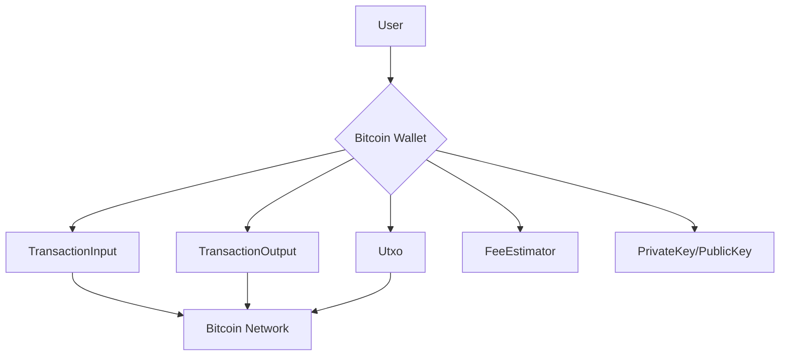
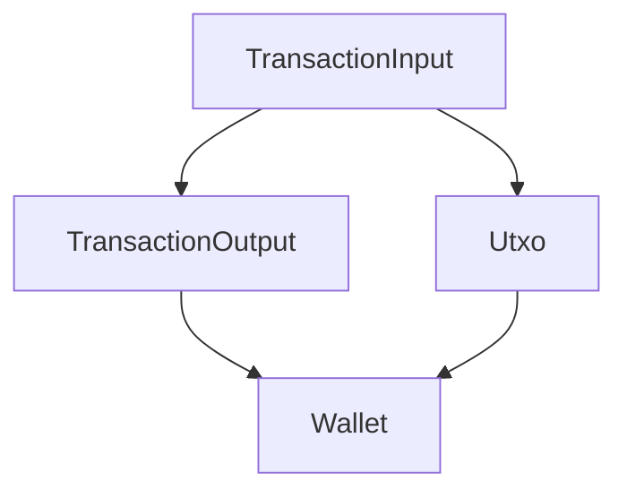
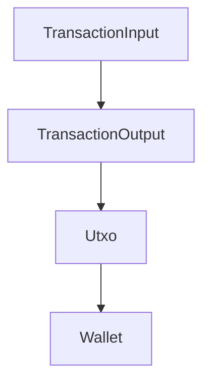
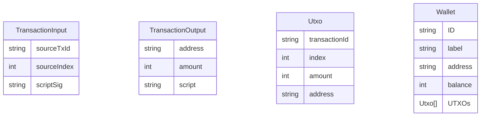

# Technical Specification Document

## 1. Executive Summary

### System Purpose and Business Value
The system is designed to manage Bitcoin transactions and wallets, providing secure and efficient handling of cryptocurrency operations. It facilitates the creation, validation, and execution of Bitcoin transactions, ensuring accurate fee estimation and secure key management. The business value lies in enabling users to manage their Bitcoin assets with confidence, leveraging robust cryptographic principles and efficient transaction processing.

### Key Capabilities
- Bitcoin transaction creation and validation
- Wallet management including balance updates and fund transfers
- Secure generation and management of cryptographic keys
- Accurate fee estimation for transactions
- Handling of unspent transaction outputs (UTXOs)

### Technology Stack Overview
- Language: Kotlin
- Cryptographic library: SecureRandom for key generation
- Data structures: Kotlin data classes for encapsulating transaction and wallet entities

## 2. System Overview

### High-Level System Description
The system is a modular application focused on Bitcoin transaction and wallet management. It includes components for handling transaction inputs and outputs, managing wallets, estimating transaction fees, and securing cryptographic keys.

### Core Components and Their Responsibilities
- **TransactionInput**: Represents inputs in Bitcoin transactions, including source transaction ID and script signature.
- **TransactionOutput**: Defines outputs in Bitcoin transactions, associating addresses with amounts.
- **Utxo**: Manages unspent transaction outputs, crucial for tracking available funds.
- **Wallet**: Aggregates UTXOs, maintains balance, and facilitates transactions.
- **FeeEstimator**: Calculates transaction fees based on network conditions.
- **PrivateKey/PublicKey**: Handles cryptographic key generation and conversion.

### System Boundaries and Interfaces
The system interfaces with external Bitcoin networks for transaction validation and execution. It provides APIs for wallet and transaction management, ensuring secure interactions with user assets.

### System Context Diagram

## 3. Functional Specifications

### Feature: Bitcoin Transaction Creation
- **Feature Name and ID**: Transaction Creation - BTC001
- **Business Requirement**: Enable users to create Bitcoin transactions securely and efficiently.
- **Functional Behavior Description**: Users can create transactions by specifying inputs, outputs, and fees. The system validates transaction details and constructs a transaction object.
- **Input/Output Specifications**: 
  - Inputs: Transaction inputs (sourceTxId, sourceIndex, scriptSig)
  - Outputs: Transaction outputs (address, amount)
- **Business Rules and Validation**: Ensure inputs are valid and outputs match specified amounts. Validate transaction fees.
- **Error Handling Behavior**: Return error codes for invalid inputs or insufficient funds.
- **Example Usage Scenarios**: User initiates a transaction from their wallet, specifying recipient address and amount.

### Feature: Wallet Management
- **Feature Name and ID**: Wallet Management - WAL001
- **Business Requirement**: Provide users with tools to manage their Bitcoin wallets.
- **Functional Behavior Description**: Users can create wallets, receive funds, and send funds. The system updates wallet balance and tracks UTXOs.
- **Input/Output Specifications**: 
  - Inputs: Wallet creation parameters (ID, label, address)
  - Outputs: Updated wallet balance and UTXO list
- **Business Rules and Validation**: Validate wallet creation parameters and ensure funds are correctly received and sent.
- **Error Handling Behavior**: Return error codes for invalid wallet operations.
- **Example Usage Scenarios**: User creates a new wallet and receives funds via a transaction.

### Feature: Fee Estimation
- **Feature Name and ID**: Fee Estimation - FEE001
- **Business Requirement**: Accurately estimate transaction fees based on network conditions.
- **Functional Behavior Description**: Calculate fees using satoshis per vbyte rate, ensuring transactions are processed efficiently.
- **Input/Output Specifications**: 
  - Inputs: Transaction size, satoshis per vbyte rate
  - Outputs: Estimated transaction fee
- **Business Rules and Validation**: Ensure fee estimation is accurate and reflects current network conditions.
- **Error Handling Behavior**: Return error codes for invalid fee estimation parameters.
- **Example Usage Scenarios**: User checks estimated fee before sending a transaction.

## 4. Technical Requirements

### Performance Requirements
- **Latency**: Transaction creation and validation should occur within 500ms.
- **Throughput**: Support up to 100 transactions per second.
- **Concurrency**: Handle concurrent wallet operations without data inconsistency.

### Scalability Requirements
- **Horizontal Scaling**: Support scaling across multiple instances for increased transaction throughput.
- **Vertical Scaling**: Optimize memory and CPU usage for efficient processing.

### Availability Requirements
- **Uptime**: Ensure 99.9% uptime for wallet and transaction services.
- **Failover**: Implement automatic failover mechanisms for critical components.

### Data Retention Requirements
- **Retention Period**: Store transaction and wallet data for a minimum of 5 years.
- **Archiving**: Implement archiving for historical transaction data.

## 5. Component Specifications

### Component: TransactionInput
- **Component Name and Purpose**: TransactionInput - Represents inputs in Bitcoin transactions.
- **Responsibilities**: Encapsulates transaction input details for validation and processing.
- **Dependencies**: Requires access to transaction output data for validation.
- **Interfaces**: Exposes methods for input validation and retrieval.
- **Internal Design Notes**: Utilizes data class pattern for encapsulation.
- **Configuration Options**: [Requires additional context]

### Component Interaction Diagram

## 6. Data Specifications

### Data Entities and Their Attributes
- **TransactionInput**: sourceTxId, sourceIndex, scriptSig
- **TransactionOutput**: address, amount, script
- **Utxo**: transactionId, index, amount, address
- **Wallet**: ID, label, address, balance, UTXOs

### Data Flow Diagram

### Entity Relationship Diagram

### Data Validation Rules
- Ensure transaction inputs and outputs are valid and match specified criteria.
- Validate wallet addresses and balance updates.

### Data Transformation Logic
- Convert private keys to public keys for transaction authorization.
- Aggregate UTXOs for wallet balance calculation.

## 7. Integration Specifications

### External System Integrations
- **Bitcoin Network**: Validate and execute transactions on the blockchain.

### API Contracts
- **Wallet API**: Create, update, and manage wallets.
- **Transaction API**: Initiate and validate transactions.

### Message Formats
- JSON for API requests and responses.

### Authentication/Authorization Mechanisms
- OAuth 2.0 for secure API access.

## 8. Error Handling Specifications

### Error Categories
- **Validation Errors**: Invalid transaction or wallet parameters.
- **Network Errors**: Issues with Bitcoin network connectivity.
- **Security Errors**: Unauthorized access attempts.

### Error Codes and Meanings
- **401**: Unauthorized access
- **404**: Resource not found
- **500**: Internal server error

### Recovery Procedures
- Retry mechanisms for network errors.
- User notifications for validation errors.

### Logging and Monitoring Requirements
- Implement logging for all transaction and wallet operations.
- Monitor system performance and error rates.

## 9. Security Specifications

### Authentication Mechanisms
- Secure user authentication using OAuth 2.0.

### Authorization Model
- Role-based access control for API endpoints.

### Data Protection Measures
- Encrypt sensitive data such as private keys and transaction details.

### Security-Sensitive Operations
- Secure key generation and storage.
- Transaction authorization and validation.

## 10. Appendices

### Glossary of Terms
- **UTXO**: Unspent Transaction Output
- **Satoshis**: Smallest unit of Bitcoin

### Reference Documents
- Bitcoin Whitepaper
- Kotlin Language Documentation

### Version History
- **v1.0**: Initial release
- **v1.1**: Added fee estimation module

[Requires additional context] for unsupported sections.